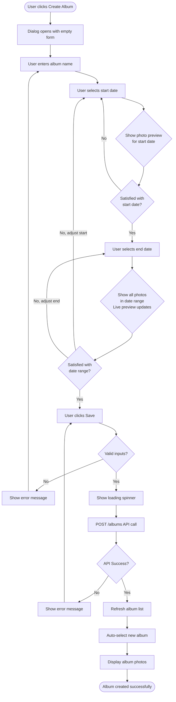

# UX Design Specification dphoto

**Author:** Arch
**Date:** Thu Jan 29 2026

---

<!-- UX design content will be appended sequentially through collaborative workflow steps -->

## Executive Summary

### Project Vision

DPhoto is a brownfield redesign transforming a functional photo management application into a polished, curiosity-driven experience for private family collections. The mission is to evolve from "functional student project" to an interface that celebrates craft, intimacy, and serendipitous memory rediscovery.

The redesign targets family-scale photo collections (2-10 members) where every photo has personal meaning. Rather than competing on algorithmic organization or massive scale, DPhoto differentiates through exceptional execution of 6 core capabilities, dark-first aesthetic, timeline-driven navigation, and random photo surfacing that sparks curiosity and emotional engagement.

This is a complete feature parity replacement requiring all capabilities to be redesigned before launch. Built on NextJS + Material UI + TypeScript, the new interface consumes the existing REST API without backend changes, targeting 60fps animations and Lighthouse Performance scores ≥90.

### Target Users

**Thomas, 39 - The Photographer & Organizer**
- Captures family moments via phone and DSLR, uploads via CLI
- Organizes hundreds of photos into albums, shares with family
- Values keyboard navigation, efficiency, and polished experience
- Wants to feel proud of curated collections, not just "dumped files"

**Claire, 45 - The Browser & Curator**
- Family memory keeper who browses albums and selects favorites to print
- Uses mobile and desktop equally, wants photo book experience
- Drawn back repeatedly by random highlights to rediscover forgotten memories
- Prefers narrative presentation over file system navigation

**Marie, 68 - Extended Family Viewer**
- Not tech-savvy, primarily views grandchildren photos on iPad
- Needs intuitive, forgiving interface with natural touch interactions
- Motivated by emotional connection - random highlights show grandchildren's faces
- Requires interface that works on older devices and recovers gracefully from errors

### Key Design Challenges

**1. Balancing Discovery with Utility**
Random photo surfacing must feel serendipitous and delightful, not distracting or annoying. Timeline narrative flow needs to coexist with efficient task completion for album management. The challenge is making "curiosity-driven" feel purposeful and meaningful, not gimmicky or frivolous.

**2. Performance vs. Polish**
Achieving 60fps animations across mobile, tablet, and desktop while maintaining smooth progressive image loading. Transitions (photo zoom, page navigation) must be purposeful and add to the experience, not feel excessive or cause jank. The polish must be felt, not just seen - technical performance constraints cannot compromise the "thoughtfully designed" perception.

**3. Multi-Device Experience Coherence**
The same design language must work for Marie's iPad touch gestures, Claire's mobile + desktop usage, and Thomas's desktop keyboard shortcuts. Mobile-first approach cannot result in desktop feeling like "blown up mobile". Each context must feel native and optimized, not compromised.

**4. Ownership & Permission Clarity**
Users see owned and shared albums mixed together in filtered views. Edit, share, and delete actions are only available for owned albums. Clear visual distinction is needed without cluttering the interface with heavy UI chrome or creating confusing permission states.

### Design Opportunities

**1. Emotional Engagement Through Craft**
Dark-first aesthetic makes photos "pop" dramatically. Smooth zoom transitions create magical "reveal" moments. Random highlights become "gift" moments - unexpected joy during routine browsing. Small details in loading states and micro-interactions communicate care and thoughtfulness, elevating the experience beyond functional.

**2. Timeline as Storytelling Interface**
Visual density indicators tell stories at a glance ("busy vacation week"). Day-grouped photos create natural narrative chapters. Album temperature metrics show activity patterns across entire collection. Timeline isn't just navigation - it's visual data storytelling about family memories over time.

**3. Keyboard Navigation as Power Feature**
Arrow keys through photo sequences create natural "slideshow flow". ESC to exit, ENTER to open - minimal learning curve. Power users like Thomas can fly through organizing tasks. Opportunity to make keyboard shortcuts discoverable through progressive disclosure without being intrusive to non-keyboard users.

**4. Progressive Enhancement for Intimacy**
Small collection size (family scale) means every photo can receive attention. No algorithmic overwhelming - curated by humans for humans. Sharing is intimate (specific email addresses), not broadcast social features. Design celebrates intimacy and personal curation over scale and automation, embracing the constraints as features.

## Core User Experience

### Defining Experience

The core user experience of DPhoto centers on **photo viewing and album browsing as the primary activity**, with album management emerging naturally and contextually from the browsing experience. Users spend most of their time viewing photos and discovering memories, with organization happening fluidly as needs arise rather than as separate "admin work."

The fundamental user loop is **"Browse → Discover → Relive → Organize (when needed)"**. Photo viewing is the payoff moment - if this feels magical, the organizing work becomes worthwhile. Album browsing and navigation between albums must be smooth and effortless, creating a continuous flow through family memories rather than discrete jumps between containers.

The defining innovation is making album management **photo-first and context-aware**. Instead of requiring users to remember dates and guess at album boundaries, the system shows photos in real-time as dates are selected. When Thomas creates an album, he sees which photos will be included. When he adjusts dates, photos appear and disappear in the preview. When Claire spots a misplaced photo while browsing, the system can suggest fixes contextually. Management flows from browsing, not against it.

### Platform Strategy

**Primary Platform:** Web application built with NextJS, responsive across mobile, tablet, and desktop devices.

**Multi-Device Experience:**
- **Desktop (Thomas - Power User):** Keyboard-driven efficiency with timeline scrubber, real-time thumbnail grid updates, and fast workflows. Arrow keys adjust dates, navigate photos, and switch between albums.
- **Mobile/Tablet (Claire, Marie):** Touch-friendly date range sliders, swipeable photo previews, natural gestures. Simplified interface maintaining same visual confidence as desktop.
- **No offline functionality required** - authenticated web experience with manual refresh model.

**Input Methods:**
- **Keyboard navigation:** Arrow keys (photo navigation, album selection, date adjustment), ESC (back/close), ENTER (open/confirm)
- **Touch gestures:** Swipe (next/previous photo), pinch-to-zoom, tap (select/open)
- **Mouse/trackpad:** Click, scroll, drag (date range selection)

**Browser Support:** Modern evergreen browsers only (latest 2 versions of Chrome, Firefox, Safari, Edge). Allows use of CSS Grid, Flexbox, ES2020+ without polyfills.

### Effortless Interactions

**Zero-Thought Actions:**

1. **Photo Navigation** - Arrow keys or swipe moves to next/previous photo. ESC exits to album view. ENTER opens full-screen. Muscle memory, no cognitive load.

2. **Random Photo Discovery** - Appears automatically while browsing timeline. Zero effort from user - system surfaces forgotten memories between albums or at timeline top.

3. **Visual Date Selection** - Creating or editing albums shows live photo preview as dates adjust. User sees exactly which photos will be included/excluded. No memorization of dates required - "these are the beach photos" visual confirmation.

4. **Contextual Error Detection** - While browsing, outlier photos (wrong date range) are subtly indicated. System suggests fixes: "This photo is from Sept 3. End album on Aug 31?" User confirms or ignores.

5. **Album Switching** - Keyboard (up/down arrows) or click/tap on album cards. Smooth transitions maintain browsing flow.

**Visual Instead of Memorization:**

- **Album Creation:** Browse timeline showing photo density clusters → Select date range while seeing photos → Create album with confidence
- **Date Editing:** Adjust date slider → Photos appear/disappear in real-time → Save when preview looks right
- **Misplaced Photo Fixes:** Spot wrong photo while browsing → Right-click or tap → System suggests date adjustment → Preview confirms fix

### Critical Success Moments

**Make-or-Break Interactions:**

1. **First Photo Zoom** - If this transition feels janky or slow, trust is broken. Must be smooth 60fps, feels magical not mechanical.

2. **Arrow Key Slideshow Navigation** - Must feel like flowing through memories, not paginating through files. Immediate response, smooth transitions between photos.

3. **Creating First Album with Visual Date Picker** - "Oh, I can SEE which photos will be included!" Confidence moment that removes anxiety about getting dates wrong.

4. **Adjusting Dates with Live Preview** - "Perfect, that's exactly the photos I want." Control moment where user sees consequences before committing. Prevents orphaned photo errors.

5. **Spotting Misplaced Photo During Browsing** - Thomas sees September photo in "Summer 2025" album. System hints it's an outlier, offers contextual fix. Guided discovery prevents frustration.

6. **Random Highlight Rediscovery** - "Wow, I forgot about this photo from last year!" Emotional engagement moment that brings users back repeatedly.

7. **Marie Successfully Navigating on iPad** - Non-tech-savvy user never gets lost, touch interactions feel natural, interface works smoothly on older device. Recovers gracefully from errors.

### Experience Principles

**Guiding Principles for All UX Decisions:**

**1. "Management flows from browsing, not against it"**

Album management happens in context of viewing photos, never forcing users to leave browsing mode to fix organizational issues. Controls appear contextually when needed and hide when not relevant. Organization is a natural extension of viewing, not a separate mode or admin task.

**2. "Show, don't ask to remember"**

Visual previews replace date memorization. Live feedback replaces guessing and hoping. Photo thumbnails confirm decisions before committing changes. Users see consequences of actions in real-time rather than discovering problems after the fact.

**3. "One interaction model, multiple input methods"**

The same core experience works seamlessly with keyboard, mouse, and touch input. Power users gain efficiency through keyboard shortcuts. Casual users get discoverability through visual controls. No audience is compromised - each gets optimized experience through their preferred input method.

**4. "Smooth is fast, fast is effortless"**

60fps animations make interactions feel effortless rather than sluggish. Progressive loading means users never wait for photos. Immediate feedback (keyboard, touch) creates flow state. Polish and performance communicate care and quality - users feel the thoughtfulness in every interaction.

**5. "Intimate scale enables contextual intelligence"**

Small collection size (family scale) allows real-time photo previews without performance concerns. System can show all photos in date range instantly. Outlier detection is practical at this scale. Every photo receives attention, nothing gets lost in algorithmic organization. Constraints become features.

## Desired Emotional Response

### Primary Emotional Goals

**"Proud craftsmanship meets curious discovery"** - The core emotional experience combines pride in curated collections with delight in serendipitous rediscovery.

Users should feel **proud** when organizing and sharing albums - like presenting a handmade photo book, not dumping files into cloud storage. Thomas feels accomplished creating albums, confident the dates are right, satisfied with the curated result he shares with family.

Simultaneously, users should feel **curious and delighted** during browsing - drawn back repeatedly by random photo highlights that surface forgotten memories. Claire discovers beach photos she hadn't thought about in months. Marie sees grandchildren's faces appear unexpectedly, creating emotional connection and joy.

The intersection of these emotions - craftsmanship and discovery - differentiates DPhoto from purely functional photo storage (lacks pride) and algorithmic photo apps (lacks human curation and intimate scale).

### Emotional Journey Mapping

**First Discovery:**
- Visual impression: "Wow, this looks polished" - dark interface makes photos pop dramatically
- Immediate perception: **Premium, intentional, crafted** (not amateur or utilitarian)
- Sets expectation: This product respects my photos and my time

**During Core Experience (Browsing/Viewing):**
- Photo zoom and arrow key navigation: **Effortless, magical flow**
- Random highlights appear: **Curiosity, surprise** - "Oh I forgot about this!"
- Day-grouped timeline narrative: **Story-driven, meaningful** (not file management drudgery)
- Smooth transitions throughout: **Confident the system won't break**

**After Task Completion:**
- Album created with visual date picker: **Confident, in control** - "I got exactly the photos I wanted"
- Shared album with family: **Proud** - "They'll love seeing these organized this way"
- Fixed misplaced photo: **Capable, empowered** - system helped rather than creating frustration
- Overall: **Accomplished** rather than relieved it's over

**When Something Goes Wrong:**
- Error message appears: **Informed, not panicked** - clear guidance on what happened and how to recover
- Marie gets lost navigating: **Recoverable** - doesn't feel stupid, can find way back easily
- Operation fails: **Supported** - system explains why and suggests alternatives

**Returning to Use Again:**
- Opens DPhoto days later: **Curious** - "What random photos will I see today?"
- **Drawn back** by discovery feature, not just utility need
- Browsing becomes habit driven by emotional engagement, not just functional requirement

### Micro-Emotions

**Critical Micro-Emotional States:**

**1. Confidence vs. Confusion**
Visual previews showing photos in real-time as dates adjust creates confidence. Users see consequences before committing. Contextual guidance prevents confusion about permissions and capabilities. Clear ownership indicators eliminate "Can I edit this?" uncertainty.

**2. Delight vs. Satisfaction**
Random photo highlights aim for delight - unexpected joy and rediscovery - beyond functional satisfaction. Smooth zoom transitions create "reveal" moments that feel magical rather than mechanical. Small details (loading states, micro-interactions) elevate beyond utilitarian.

**3. Accomplishment vs. Frustration**
Contextual album management (visual date selection, live previews, outlier detection) prevents frustration from forgotten dates, orphaned photos, or permission confusion. Real-time feedback creates sense of accomplishment and control rather than trial-and-error frustration.

**4. Trust vs. Skepticism**
60fps polish and consistent performance build trust in product quality. Works smoothly on Marie's older iPad - proves reliability. Graceful error recovery and clear messaging maintain trust when issues occur. Every detail signals "this was made with care."

**5. Excitement vs. Anxiety**
First-time album creation should feel exciting (visual feedback showing photos) rather than anxious (guessing dates, hoping it works). Undo/cancel always available makes experimentation safe. Confidence-building design choices transform potentially stressful tasks into engaging experiences.

### Design Implications

**Creating Pride & Accomplishment:**
- Dark-first aesthetic presents photos at gallery quality, premium presentation
- Smooth 60fps transitions communicate craftsmanship - "this was made with care"
- Polished loading states make even waiting feel intentional, not broken
- Visual album cards with temperature indicators make collections feel curated and meaningful
- Timeline organization creates narrative, not just functional grouping

**Creating Curiosity & Delight:**
- Random photo highlights as unexpected "gifts" between albums or at timeline top
- Subtle fade-in animations draw attention without being jarring or interruptive
- Algorithm ensures variety - different highlights each visit keep experience fresh
- Timeline visual density clusters spark curiosity: "busy week there - what was happening?"
- Discovery is invited through design, never demanded or intrusive

**Creating Confidence & Control:**
- Visual date picker with live photo preview - see exactly what's included, zero guessing
- Real-time feedback as dates adjust - photos appear/disappear immediately
- Contextual error detection - "This photo seems out of place" suggestions vs. silent failure
- Clear ownership indicators prevent confusion about editing capabilities
- Undo/cancel always available - safe to experiment without fear of breaking things

**Creating Effortless Flow:**
- Keyboard shortcuts (arrows, ESC, ENTER) build muscle memory for power users
- <100ms immediate response on all interactions prevents perception of lag
- Progressive image loading eliminates staring at spinners
- Contextual management allows fixing issues while browsing - never breaks flow state
- Smooth transitions between states maintain engagement rather than jarring context switches

**Creating Trust:**
- Consistent polish across every detail (loading skeletons, error messages, micro-interactions)
- Graceful degradation ensures functionality on older devices (Marie's iPad)
- Clear error recovery paths - users never stuck without forward progress
- Performance targets consistently met - 60fps promise delivered in practice
- Reliability builds emotional safety - users trust their valuable photos are respected

### Emotional Design Principles

**Guiding Principles for Emotional UX:**

**1. "Every interaction should feel crafted, not coded"**

Small details receive as much attention as major features. Loading states, transitions, error messages, micro-interactions all communicate thoughtfulness. Users should sense care in every interaction - polish is felt, not just seen. Technical implementation disappears behind intentional experience design.

**2. "Confidence through visibility"**

Never ask users to guess, remember, or hope. Show consequences before committing to actions. Real-time feedback replaces anxiety with control. Visual previews eliminate uncertainty. Clear messaging transforms potentially confusing situations into understandable ones. Users feel in control because they can see what's happening.

**3. "Delight through discovery, not interruption"**

Random highlights are gifts, not notifications. Subtle, optional, changing each visit. Curiosity is invited through thoughtful placement and presentation, never demanded through aggressive interruption. Discovery feature respects user attention and browsing flow. Joy emerges from serendipity, not algorithmic pushing.

**4. "Polish communicates respect"**

60fps performance, graceful degradation on older devices, clear error recovery signal that user's time and photos are valued. Technical excellence creates emotional trust - quality execution demonstrates product and user are both taken seriously. Performance isn't just technical requirement, it's respect made tangible.

**5. "Intimacy over scale"**

Design celebrates family-scale collections where every photo matters. Embrace human curation rather than algorithmic organization. Make constraints (small scale, manual organization) feel like premium features - attention and care impossible at massive scale. Intimacy becomes competitive advantage, not limitation.

## UX Pattern Analysis & Inspiration

### Design Philosophy

DPhoto is intentionally a **smaller, focused tool** - not competing with feature-rich photo services like Google Photos or iCloud. The design prioritizes **good browsing experience, simple album organization, and sharing** that works seamlessly on desktop and mobile.

Rather than analyzing complex competitor patterns, the UX strategy focuses on:
- **Material UI standard patterns** - leverage built-in, tested components
- **Pragmatic simplicity** - use familiar, conventional UX patterns
- **Selective enhancement** - add custom features only where they provide clear value
- **Brand identity** - customize Material UI with DPhoto's brand color throughout

Transitions, animations, and polish are appreciated but only implemented if they come naturally with Material UI's built-in capabilities. The goal is functional, clean, and brand-consistent rather than feature-rich or over-polished.

### Core UX Patterns

**Visual Date Selection for Album Management**

The challenge: Users need to see photo dates to know what date ranges to enter when creating or editing albums. Simply asking users to remember dates is not sufficiently visual.

**Chosen Approach - Hybrid Contextual + Preview:**

**Primary Flow: Create Album from Media List (Contextual)**
- Users browse all photos in master timeline view showing date clusters and density patterns
- Context action (right-click or button): "Create album from [date range]"
- System suggests dates based on visible photos in current view
- Opens dialog with pre-filled dates and photo preview
- **Value:** Contextual, leverages existing browsing flow, smart defaults
- **Implementation:** Medium complexity - requires context awareness and date suggestion logic

**Secondary Flow: Manual Creation with Live Preview**
- Traditional "Create Album" action opens dialog
- Material UI date range picker for start/end dates
- Side panel displays thumbnail grid: "Photos in this range: [~12 thumbnails]"
- Photo count updates as dates adjust: "47 photos"
- Preview updates in real-time as user changes dates
- **Value:** Visual confirmation, error prevention, confidence building
- **Implementation:** Medium complexity - fetch and render photos on date change

Both flows use the same underlying preview mechanism. The hybrid approach provides contextual intelligence (Option D) for the common case while maintaining traditional manual creation (Option B) as a reliable fallback.

**Alternatives Dismissed:**
- **Simple date picker without preview** - Too simple, doesn't solve the core problem of needing to see photos to know dates
- **Photos-first direct selection** - Most intuitive but highest complexity with custom selection interactions, non-standard pattern

**Random Photo Discovery**

API supports random photo retrieval. Focus on two natural placement areas that provide discovery without disruption.

**Album Card Samples (Primary Discovery)**
- Each album card displays 3-4 random photo thumbnails as preview grid/carousel
- Samples change on page refresh, providing visual variety
- Click any thumbnail opens album directly to that photo
- **Value:** See album contents before clicking, visual interest, passive discovery
- **Implementation:** Low complexity - API provides randoms, display as thumbnail grid

**Home Page Highlights (Secondary Discovery)**
- Top section labeled "Your Memories" or "Highlights"
- Horizontal row of 5-8 random photos from across all accessible albums
- Each photo links to its source album
- Refreshes each visit
- **Value:** Immediate engagement, cross-album discovery, curiosity spark
- **Implementation:** Low complexity - API provides randoms, display with album links

Random discovery happens in two natural, non-disruptive locations. Users encounter variety passively while browsing rather than through interstitial interruptions.

**Album Activity Indicators**

Current version uses flame icon (more/less full) based on photos-per-day density. Received good user feedback.

**Chosen Approach: Density Color-Coding**
- Photo count with visual density indication through color
- High density albums: Warmer colors or bolder display
- Low density albums: Cooler colors or lighter display
- Integrates cleanly with album card layout alongside media samples
- **Value:** At-a-glance understanding of album size/activity before clicking
- **Implementation:** Low complexity - calculate density, apply color coding

**Alternative Considered:**
- Keep flame icon if it integrates well with media samples
- Decided on color-coding for cleaner visual integration

Activity indication helps users understand album characteristics (busy vacation week vs. sparse collection) before opening.

**Timeline and Browsing Experience**

Albums displayed in chronological order with clear date information. Master media view (all photos) shows timeline with date headers and visual density clusters to aid in identifying natural album boundaries.

Material UI card layouts, grids, and list components provide the foundation. Responsive breakpoints ensure mobile and desktop experiences both feel native rather than compromised.

### Design System Strategy

**Material UI Foundation with Brand Customization**

The design builds on Material UI's component library rather than creating custom components from scratch. This provides:
- Tested, accessible components out of the box
- Mobile responsiveness built-in
- Consistent interaction patterns users already understand
- Reduced development complexity

**Brand Color Integration: #185986 (Blue)**

DPhoto's brand blue (#185986) is integrated throughout the interface rather than using Material UI's default blue. This establishes strong brand identity.

**Primary Uses:**
- Primary action buttons (Create Album, Share, Save) - brand blue background
- Selected states - active album card with blue border/glow
- Links and clickable elements - brand blue color
- Focus indicators - keyboard navigation highlights in blue

**Secondary/Subtle Uses:**
- Logo area
- Album card accents - subtle blue line or corner treatment
- Loading indicators - progress bars and spinners

**Dark Theme Palette:**
- Background: Dark grey/black (#121212 or similar)
- Text: White/light grey for readability
- Primary accent: Brand blue #185986
- Photos: Pop dramatically against dark background

The brand color appears consistently throughout the experience, not just in the logo. Material UI components are themed with this color as the primary accent.

### Anti-Patterns to Avoid

**Over-Engineering Simple Features**
Avoid building complex custom interactions when Material UI provides adequate standard patterns. The goal is functional and clean, not showcasing technical complexity. Every custom pattern must justify its implementation cost with clear user value.

**Competing with Large-Scale Services**
DPhoto is intentionally smaller scope than Google Photos or iCloud. Avoid feature comparisons or attempting feature parity. Focus on the core capabilities (browse, organize, share) done well rather than extensive feature lists done adequately.

**Generic Material UI Styling**
While leveraging Material UI components, avoid looking like a default Material UI demo. Brand color integration and thoughtful customization maintain DPhoto's identity while benefiting from Material UI's foundation.

**Breaking Established Patterns Without Reason**
Users understand standard navigation, card layouts, and form patterns. Don't reinvent conventions unless there's specific user value. Familiar patterns reduce cognitive load, especially for less tech-savvy users like Marie.

**Feature Bloat for "Polish"**
Transitions and animations are nice-to-have only if they come cheaply with Material UI. Avoid spending development time on elaborate polish when core functionality provides the real value. Smooth and functional beats janky and over-animated.

### Design Inspiration Strategy

**What to Adopt:**
- **Material UI component patterns** - cards, grids, dialogs, date pickers - proven and accessible
- **Standard navigation patterns** - familiar layouts reduce learning curve
- **Responsive grid systems** - built-in mobile/desktop adaptation
- **Dark theme aesthetics** - photos as primary visual focus against dark backgrounds

**What to Adapt:**
- **Material UI theming** - customize with brand color #185986 throughout
- **Card layouts** - extend with random photo samples and density indicators
- **Date pickers** - enhance with live photo preview panels
- **Standard dialogs** - add contextual photo previews for album management

**What to Avoid:**
- **Complex competitor features** - AI tagging, facial recognition, advanced search - out of scope
- **Custom animation frameworks** - use Material UI's built-in transitions only
- **Novel interaction patterns** - stick with familiar conventions unless clear value justifies custom work
- **Feature parity thinking** - DPhoto succeeds by being focused and simple, not comprehensive

This strategy guides design decisions: leverage proven patterns from Material UI, customize thoughtfully for brand and specific user needs (visual date selection, random discovery), and avoid complexity that doesn't serve the core experience of browsing, organizing, and sharing family photos.

## Design System Foundation

### Design System Choice

**Material UI (MUI)** serves as the design system foundation for DPhoto's web interface. This choice provides a proven component library with strong theming capabilities, allowing brand customization while leveraging battle-tested patterns and accessibility features.

Material UI offers the right balance between development speed (pre-built components) and visual uniqueness (themeable with brand color #185986). Rather than building custom components from scratch or using generic defaults, MUI enables rapid development with intentional brand integration.

### Rationale for Selection

**Proven Component Library**
Material UI provides a comprehensive set of tested, accessible components out of the box including card layouts, grids, dialogs, date pickers, and navigation patterns. Active community support, extensive documentation, and production-proven reliability reduce implementation risk. All core components needed for DPhoto's browsing, organizing, and sharing features exist within MUI.

**Theming and Customization**
Strong theming system allows brand blue (#185986) integration throughout the interface rather than using generic Material Design defaults. Dark theme support is built-in. Components can be customized without rebuilding from scratch, providing the balance of brand uniqueness and development speed. Theme tokens (colors, spacing, typography) cascade consistently across all components.

**Mobile Responsiveness**
Built-in responsive breakpoints and grid system handle mobile, tablet, and desktop layouts. Touch-friendly interactions on mobile/tablet work naturally with MUI components. Desktop and mobile experiences feel native and optimized rather than compromised. Reduces development time for multi-device support significantly.

**Implementation Pragmatism**
Transitions and animations come naturally with MUI's built-in capabilities - use what exists rather than building custom animation frameworks. Lower learning curve compared to custom component development. Maintenance supported by MUI team updates and security patches. Integration with NextJS and TypeScript is well-documented with established patterns.

**Accessibility Foundation**
WCAG compliance built into components provides keyboard navigation, focus management, ARIA labels, and semantic HTML structure. Reduces accessibility work required while ensuring Marie and other users can navigate effectively. Screen reader support and keyboard navigation work out of the box.

### Implementation Approach

**Base Setup:**
- Install Material UI with NextJS App Router integration
- Configure dark theme as default mode
- Set brand blue (#185986) as primary color in theme configuration
- Establish responsive breakpoints: Mobile (<600px), Tablet (600-960px), Desktop (>960px)
- Configure typography scale and spacing system from MUI defaults

**Component Strategy:**

**Use Directly (No Customization):**
Buttons, standard form inputs, switches, basic cards, grids, dialogs, app bar, drawer, navigation components, icons, typography, spacing utilities.

**Customize Lightly (Extend MUI Components):**
- Date pickers - add photo preview panel showing thumbnails for selected date range
- Album cards - add random photo sample grid (3-4 thumbnails) and density color-coding
- Dialogs - extend with photo preview functionality for album management

**Custom Components (Build When MUI Insufficient):**
- Photo timeline view with day-grouped headers
- Album density visualization with color-coding
- Random photo highlights layout (home page and album cards)
- Master media view showing all photos with date clusters

**Avoid Custom (Trust MUI):**
Don't rebuild navigation patterns, form interactions, responsive grid behavior, accessibility features, or standard transitions that MUI provides adequately.

**Theme Configuration Example:**
```typescript
palette: {
  mode: 'dark',
  primary: {
    main: '#185986', // Brand blue
  },
  background: {
    default: '#121212',
    paper: '#1e1e1e',
  },
  text: {
    primary: '#ffffff',
    secondary: 'rgba(255, 255, 255, 0.7)',
  },
}
```

**Performance Considerations:**
- Use MUI's tree-shaking to include only used components in bundle
- Lazy load heavy components (dialogs, large grids) where appropriate
- Progressive image loading handled separately from MUI component loading
- Monitor bundle size during development to avoid bloat

### Customization Strategy

**Brand Integration Throughout:**
- Primary action buttons (Create Album, Share, Save) use brand blue (#185986) background
- Selected states (active album card, focused inputs) highlight with blue border or glow effect
- All links and clickable elements use brand blue color
- Focus indicators for keyboard navigation use brand blue
- Loading indicators, progress bars, and spinners themed with brand color
- Logo area features brand blue with subtle accents on navigation or album cards

**Component Customization Priorities:**

**High Priority - Must Customize:**
1. **Album Cards** - Add 3-4 random photo thumbnail samples in grid/carousel layout, integrate density color-coding with photo count
2. **Date Picker Dialogs** - Extend with side panel showing ~12 photo thumbnails from selected date range, update preview in real-time as dates adjust
3. **Photo Grid/Timeline** - Custom layout for day-grouped photos with date headers, responsive across mobile/desktop
4. **Navigation and Branding** - Integrate DPhoto logo with brand blue (#185986) subtle accents, ensure brand presence

**Medium Priority - Customize If Time/Value Justifies:**
5. **Loading States** - Brand-consistent skeleton screens for album cards and photo grids, themed spinners
6. **Empty States** - Contextual messages when no albums exist or album is empty, potentially custom illustrations
7. **Error Messages** - Helpful, contextual error displays with clear recovery actions

**Low Priority - Use MUI Defaults:**
8. Standard form inputs, buttons, switches - MUI defaults work well
9. Typography and spacing system - leverage MUI's design tokens
10. Standard page transitions - use what MUI provides without custom animation work

**What NOT to Customize:**
- Core interaction patterns (navigation, form submission, dialog flows) - use MUI conventions users already understand
- Accessibility features (keyboard navigation, focus management, ARIA) - trust MUI's tested implementation
- Responsive grid behavior - leverage MUI's breakpoint system rather than custom media queries
- Standard components that work adequately as-is - avoid customization for customization's sake

This customization strategy focuses effort where brand identity and unique DPhoto features (visual date selection, random discovery, album samples) require custom work, while leveraging MUI's proven patterns for standard functionality. The result is a branded, functional interface built efficiently on a solid foundation.

## Defining Core User Experience

### Defining Experience

**"Browsing through family photos feels smooth, beautiful, and full of discovery"**

DPhoto's defining experience centers on the photo viewing interaction - if this feels magical, everything else follows. Users open the app, encounter random highlights that spark curiosity, browse albums with visual confidence (seeing photo samples before clicking), and experience smooth, responsive photo viewing with progressive loading and effortless navigation.

The core user loop: Open app → See random highlights (curiosity spark) → Browse album with photo samples → Smooth photo viewing experience → Discover forgotten memories → Repeat. This loop combines utility (organizing and viewing photos) with delight (serendipitous discovery).

Secondary defining experiences support the core:
- **Visual album organization** - see photos while selecting dates, creating confidence and eliminating guesswork
- **Contextual management** - fix issues while browsing, not in separate admin modes
- **Discovery through randomness** - different highlights each visit keep experience fresh

If the photo viewing experience feels janky, slow, or confusing, the entire product fails regardless of other features. Smooth, responsive photo navigation with progressive loading and clear context (day headers, position indicators) is the non-negotiable foundation.

### User Mental Model

**How Users Think About Photo Organization:**

Users bring mental models from multiple sources:
- **Google Photos / iCloud:** Algorithmic organization, search-based, massive scale
- **Physical photo albums:** Manual curation, chronological storytelling, intimate collections
- **File systems:** Folders organized by date or event, hierarchical navigation

**DPhoto's Mental Model:**
DPhoto combines **manual curation** (like physical albums) with **digital convenience** (search, share, access anywhere). Chronological organization by default (timeline) but human-defined boundaries (album date ranges). Small family scale means every photo matters - no algorithmic dumps or overwhelming libraries.

**User Expectations:**
- Thomas expects albums to represent **time periods/events** ("Santa Cruz Beach Trip 2026")
- Claire thinks of albums as **stories/memories** to revisit and curate for printing
- Marie just wants to **see photos** easily - doesn't think about organization structures
- All users expect **owned albums to be editable**, shared albums to be read-only

**Potential Confusion Points:**
- Understanding owned vs. shared albums (requires clear visual distinction in UI)
- Knowing what actions are available (edit/share buttons contextual to ownership)
- Date selection without seeing photos (solved with visual preview showing what's included)
- Permission boundaries (which albums can be edited, who can share)

The interface must match these mental models: chronological timeline view for browsing, clear ownership indicators, visual feedback for organizational decisions, and contextual actions based on permissions.

### Success Criteria

**Photo Viewing (Must-Nail Success Criteria):**
- Photos load progressively with blur-up technique - users never stare at blank spaces or spinners
- Navigation feels instant - arrow keys, swipe, and click responses under 100ms
- Transitions are smooth if implemented - zoom in/out doesn't jank or stutter
- Day-grouped headers provide context - "these photos are from July 15"
- Getting back to album list is obvious and quick - ESC, back button, clear navigation
- Position awareness - user knows where they are (photo 5 of 47)
- Works smoothly on Marie's older iPad - no performance degradation

**Album Browsing Success:**
- Can preview album contents before clicking - random photo samples show what's inside
- Can assess album size/activity before opening - density color-coding provides at-a-glance info
- Random highlights spark curiosity without being disruptive - discovery feels like gift, not interruption
- Loading states communicate progress - skeleton cards, not blank pages or confusion
- Filtering works intuitively - "My Albums" vs "All Albums" is immediately clear
- Scroll position maintained - returning from album doesn't jump back to top

**Album Organization Success:**
- Visual confidence during creation - see exactly which photos will be included while picking dates
- Real-time preview prevents errors - photos appear/disappear as dates adjust
- Contextual fixes don't break flow - misplaced photos correctable while browsing
- Confirmation comes from seeing results - no guessing whether it worked
- Errors are clear and recoverable - orphaned photo warnings before committing, not after

**Overall Success Indicator:**
Users say "this just works" - the experience feels obvious, responsive, and trustworthy rather than confusing, sluggish, or uncertain.

### Novel UX Patterns

**Established Patterns (Familiar, Proven):**
DPhoto leverages standard patterns users already understand:
- **Card-based album list** - familiar from every photo app and content aggregator
- **Grid/timeline photo viewing** - standard pattern across photo applications
- **Click to zoom, ESC to close** - universal interaction behavior
- **Dialogs for create/edit operations** - familiar modal pattern for focused tasks
- **Chronological sorting** - expected default for photo/memory applications

**Innovative Patterns (Custom to DPhoto):**

**Visual Date Selection with Live Photo Preview**
Novel approach solving the "remembering dates" problem. As user adjusts date range in picker, side panel shows ~12 photo thumbnails from that range with count ("47 photos"). Updates in real-time. Not standard in photo apps but addresses clear user pain point - eliminates guesswork and provides confidence.

**Random Photo Samples on Album Cards**
Most photo apps show single cover image or first photo. DPhoto shows 3-4 random thumbnails on each album card, changing on page refresh. Provides preview of album contents and visual variety without user action. Passive discovery that makes browsing more engaging.

**Contextual Album Creation from Media List**
"Create album from [visible date range]" action while browsing all photos. System suggests dates based on what's visible in current view. Opens dialog with pre-filled dates and photo preview. Contextual and intelligent rather than requiring user to memorize dates before initiating creation.

**Random Highlights for Discovery**
Home page shows 5-8 random photos from across all accessible albums with links to source albums. Changes each visit. Serendipitous memory rediscovery without algorithmic spam or notifications. Curiosity-driven rather than utility-driven feature.

**Innovation Philosophy:**
Innovate selectively where there's clear user value (visual confidence, discovery). Use familiar patterns for core navigation and viewing to reduce cognitive load. Balance uniqueness with usability - novel patterns must justify learning curve with clear benefits.

### Experience Mechanics

**Core Interaction 1: Photo Viewing (Must-Nail)**

**Initiation:**
- User clicks album card (with random photo samples visible) or clicks random highlight photo from home page
- System loads album displaying day-grouped photo timeline

**Interaction:**
- User scrolls through photos grouped by day with date headers providing context
- Click/tap photo opens full-screen view with smooth zoom transition (if MUI provides naturally)
- **Desktop:** Arrow keys navigate next/previous photos, ESC closes back to album view
- **Mobile:** Swipe left/right for next/previous, tap X or swipe down to close
- Progressive loading displays blur-up from low to high quality resolution
- Day context remains visible via date header or overlay
- Current position indicated (photo 5 of 47)

**Feedback:**
- Immediate response to all inputs (target <100ms)
- Smooth transitions if MUI provides without custom work
- Loading states show progressive blur-up, never blank spaces
- Position awareness communicated clearly
- Context (date, album name) always accessible

**Completion:**
- ESC key or tap X returns to album view maintaining scroll position
- Can immediately navigate to next album or return home
- No dead ends or confusion about next action

**Core Interaction 2: Album Browsing & Discovery**

**Initiation:**
- User opens DPhoto landing on home page
- "Your Memories" section at top shows 5-8 random highlights
- Below: Chronological list of album cards

**Interaction:**
- **Random highlights:** Click any photo opens source album directly at that photo
- **Album cards:** Display 3-4 random photo samples, album name, date range, photo count with density color-coding
- Scroll through chronological album list
- Filter by owner (My Albums, All Albums, specific owner)
- Loading displays skeleton cards using MUI defaults

**Feedback:**
- Album cards preview contents via photo samples - know what's inside before clicking
- Density color indicates busy vs. sparse albums at a glance
- Owner information shows who shared album (if not current user)
- Sharing indicators display avatars of users with access
- Random highlights change each visit providing fresh discovery

**Completion:**
- Select album opens photo timeline view
- Or continue browsing and discovering
- Clear navigation paths - no dead ends

**Core Interaction 3: Visual Album Creation (Innovation)**

**Primary Flow - Contextual Creation from Media List:**

**Initiation:**
- User browses "All Photos" master timeline view showing date clusters and density patterns
- Right-click or button action: "Create album from [visible date range]"

**Interaction:**
- Dialog opens with suggested dates pre-filled based on visible photos in current view
- Side panel displays ~12 photo thumbnails with count: "These 47 photos will be included"
- User adjusts start/end dates, preview updates in real-time showing photos added/removed
- Enter album name (required field)
- Optional: enable custom folder name toggle and provide custom name
- **Desktop:** Tab through fields, arrow keys adjust dates
- **Mobile:** Touch-friendly date picker with scrollable photo preview

**Feedback:**
- Photo count updates dynamically as dates change: "47 photos" → "52 photos"
- Thumbnail grid updates showing which photos included/excluded
- Validation: end date must be after start date, name cannot be empty
- Warning if date changes would orphan photos (create photos with no album)
- Loading state during creation using MUI spinner with brand blue

**Completion:**
- "Create Album" button (brand blue background) commits action
- Success: Dialog closes, album list refreshes with new album
- New album automatically selected and displayed
- Clear confirmation via toast or success message

**Secondary Flow - Manual Creation:**
Same mechanics initiated from "Create Album" button without pre-filled dates. User selects dates first, then sees preview. Both flows use identical preview mechanism.

**Core Interaction 4: Sharing Albums**

**Initiation:**
- Album owner clicks sharing indicator or "Share" button on owned album
- Dialog opens displaying currently shared users

**Interaction:**
- Input field: "Enter email address"
- Shows user suggestions if available
- Enter email address → Grant access action
- Existing shared users displayed with avatars and names
- Click X icon on user → Revoke access (with confirmation prompt)

**Feedback:**
- Email validation on field blur
- "Access granted" confirmation with user avatar appearing in shared list
- "Access revoked" confirmation with user removed from list
- Clear error messages if grant/revoke operations fail
- Loading state during API calls

**Completion:**
- Close dialog returns to album view
- Sharing indicators update on album card showing new shared users
- Shared user can now see album in their accessible album list

**Navigation Patterns:**

**Desktop:**
- Arrow keys: Navigate photos, adjust date values
- ESC: Close dialogs/modals, exit full-screen view
- ENTER: Open selected item, confirm actions
- Tab: Move through form fields
- Click: Select, open, activate actions

**Mobile:**
- Tap: Select, open items
- Swipe: Next/previous photo navigation
- Pinch: Zoom if supported by browser/device
- Pull-to-refresh: Reload page (updates random highlights)
- Standard touch gestures for scrolling and interaction

**Universal:**
- Browser back button functions correctly (NextJS routing)
- Breadcrumbs or clear back navigation visible
- Logo click returns to home page
- Consistent navigation model across all views

**Error Handling & Edge Cases:**

**Photo Loading Failure:**
- Display placeholder with clear "Failed to load" message and retry button
- Don't block other photos from loading - isolated failures

**Album Empty (No Photos in Date Range):**
- Clear message: "No photos in this date range"
- Suggest actions: adjust album dates or upload photos via CLI

**Permission Errors:**
- Clear message: "You don't have permission to edit this album"
- Hide edit/share/delete buttons for albums not owned by current user
- Visual distinction between owned and shared albums prevents confusion

**Network Offline:**
- Display cached data if available
- Clear "offline" indicator shown
- Allow retry action when connection restored
- Graceful degradation - don't break entire interface

## Visual Design Foundation

### Color System

**Dark Theme Palette with Sci-Fi Influences**

DPhoto uses a dark theme that makes photos the primary visual focus while incorporating modern, sci-fi-inspired UI elements with thin contrasting lines and minimal chrome.

**Core Colors:**
- **Background:** Deep dark (#121212) provides base canvas
- **Surface/Cards:** Slightly lighter (#1e1e1e) for elevated content
- **Brand Blue (#185986):** Primary actions, focus states, active elements, links
- **Accent Lines:** Light cyan/blue (#4a9ece) or desaturated white (#6a7a8a) for thin separator lines
- **Text Primary:** White (#ffffff) for high contrast readability
- **Text Secondary:** rgba(255, 255, 255, 0.7) for metadata and less prominent content
- **Error/Warning:** Red/orange (#ff5252) for error states
- **Success:** Green (#4caf50) for confirmations

**Sci-Fi Line Aesthetic:**
Thin borders (1-2px) with gaps or margins separating content. Lines don't always complete boxes - can start/stop with margins creating incomplete frames. Subtle glow effects on interactive elements using brand blue. High contrast against dark background ensures visibility while maintaining minimal aesthetic.

**Semantic Color Mapping:**
- Primary: #185986 (brand blue) - buttons, links, selected states
- Background: #121212 - main canvas
- Surface: #1e1e1e - cards, dialogs, elevated content
- Border: rgba(74, 158, 206, 0.3) - thin separator lines with transparency
- Text: #ffffff / rgba(255,255,255,0.7) - primary and secondary text
- Error: #ff5252 - error messages and warnings
- Success: #4caf50 - success confirmations

**Accessibility Compliance:**
All color combinations tested for WCAG contrast ratios. Brand blue #185986 on dark background meets minimum 4.5:1 for text. White text on #121212 provides high contrast. Thin lines (minimum 1px, 2px for key elements) remain visible across devices including older iPads.

### Typography System

**Modern, Clean, Minimal Approach**

Typography emphasizes readability on dark backgrounds with clean, modern typefaces and generous spacing. Thin to medium weights align with minimal aesthetic.

**Primary Typeface:**
Roboto (Material UI default) or Inter for more modern feel. Both provide excellent readability on screens with comprehensive weight options.

**Type Scale:**
- **H1:** 32-36px - Page titles (rarely used)
- **H2:** 24-28px - Album names, primary headings
- **H3:** 18-20px - Section headers, dialog titles
- **Body:** 14-16px - General text, descriptions, form labels
- **Small:** 12-13px - Captions, dates, photo counts, metadata

**Font Weights:**
- Light (300): Body text for minimal aesthetic
- Regular (400): Standard body text
- Medium (500): Emphasis, button text, active elements
- Bold (700): Sparingly - only for critical emphasis

**Typography Principles:**
- Generous line height (1.5-1.6) for readability on dark backgrounds
- Consider monospace for dates/timestamps if fits aesthetic
- Uppercase for section labels used sparingly
- Letter-spacing adjustments for small text readability
- Avoid heavy bold weights - conflicts with minimal aesthetic

**Sci-Fi/Gaming Influence:**
Metadata like dates, photo counts, and technical information could use monospace or slightly wider letter-spacing for futuristic feel. Section labels in uppercase with increased letter-spacing (0.05-0.1em) creates clean separation.

### Spacing & Layout Foundation

**Modern Minimal with Generous Breathing Room**

Photos need space to be the primary focus. Layout uses asymmetry and negative space rather than dense information packing.

**Spacing System:**
- **Base unit:** 8px (Material UI standard, maintains consistency)
- **Component spacing:** 16px (2 units) between related elements
- **Section spacing:** 32-48px (4-6 units) between major sections
- **Photo grid gaps:** 4-8px tight spacing to emphasize photos as continuous timeline
- **Card padding:** 16-24px internal padding for content breathing room

**Layout Principles:**

**Photos as Primary Focus**
Photos occupy maximum space. UI chrome minimal. Day headers and metadata use thin lines and small text that doesn't compete visually with photos.

**Asymmetric Layouts Acceptable**
Not everything needs to be centered or rigidly gridded. Content floats against dark background. Thin separator lines provide structure without heavy borders.

**Minimal Chrome Strategy**
Avoid heavy borders, shadows, or filled backgrounds. Use thin 1-2px lines with margins. Lines can be incomplete (don't span full width, can have gaps). Subtle rather than prominent.

**Album Card Layout:**
- Minimal borders (thin 1px line, possibly incomplete/gapped)
- Random photo grid occupies most card space
- Metadata (name, date range, count with density color) below photos
- Subtle thin separator line between photos and metadata
- Hover/active state: subtle blue glow or line color change to brand blue

**Photo Grid Layout:**
- Tight photo spacing (4-8px gaps) creates cohesive timeline
- Day headers: thin horizontal line above with date text
- Full-width photos on mobile, responsive grid on desktop
- Minimal UI during photo viewing - maximize photo display area

**Dialog/Messaging Layout (Sci-Fi/Gaming Influence):**
Centered content with dark semi-transparent backdrop. Thin horizontal lines above and below message content instead of full rounded rectangle boxes. Lines can have margins (don't span full width). Optional corner accents (L-shaped thin lines) instead of complete frames. Minimal chrome - just enough visual separation from background.

Example centered error message:
```
     ________________________
     
     ERROR: Album Not Found
     The album you're looking for doesn't exist
     
     [Retry]  [Go Home]
     ________________________
```

Horizontal lines don't need to connect or span full width - just provide top/bottom separation with margins.

**Grid System:**
Material UI responsive grid (12 columns) provides foundation. Breakpoints: Mobile (<600px), Tablet (600-960px), Desktop (>960px). Album cards responsive: 1 column mobile, 2-3 columns tablet, 3-4 columns desktop depending on content density.

### Accessibility Considerations

**Contrast and Visibility:**
All color combinations tested for WCAG AA compliance (minimum 4.5:1 contrast ratio for text). Brand blue #185986 on dark backgrounds meets standards. White text on #121212 provides high contrast. Thin lines minimum 1px width, 2px for critical separators to ensure visibility on all devices including older iPads.

**Keyboard Navigation:**
Focus states use brand blue glow or outline clearly visible against dark background. Tab order logical and consistent. All interactive elements keyboard accessible despite minimal UI aesthetic. ESC, ENTER, arrow keys work as expected.

**Touch Targets:**
Minimum 44x44px touch targets on mobile even with minimal UI aesthetic. Thin visual elements can occupy larger interactive areas. Buttons and clickable elements sized appropriately for touch interaction.

**Readability:**
Light text (300 weight) on dark background requires larger font sizes and generous line height for readability. Minimum 14px body text. Metadata minimum 12px. High contrast ensures text remains readable despite minimal styling.

**Screen Reader Support:**
Material UI components provide ARIA labels and semantic HTML. Custom styled components (thin-line dialogs, custom cards) maintain accessibility attributes. Alt text for all photos. Clear labels for all form inputs and actions.

**Testing Requirements:**
- Contrast checker verification for all color combinations
- Test on older devices (Marie's iPad) to ensure thin lines visible
- Keyboard navigation testing for focus visibility
- Screen reader testing for custom components
- Touch target size verification on actual mobile devices

### Implementation Strategy with Material UI

**Theme Customization Approach:**

Material UI provides foundation but requires significant customization to achieve modern minimal sci-fi aesthetic with thin lines and minimal chrome.

**Components to Override:**

**Dialogs/Modals:** Remove rounded corners (borderRadius: 0), replace box shadow with custom thin-line treatment using pseudo-elements for top/bottom lines with margins.

**Cards:** Replace MUI elevation shadows with thin borders (1px solid with transparency), remove rounded corners, use transparent or minimal backgrounds.

**Buttons:** Minimal styling - thin borders for outlined buttons, text-only with brand blue for text buttons, filled buttons sparingly for primary actions.

**Dividers:** Custom thin lines with margins instead of full-width MUI Divider component. Lines can be incomplete or gapped for visual interest.

**Form Inputs:** Adapt with thin borders, minimal styling, brand blue focus states with subtle glow.

**Components to Keep:**

**Grid System:** MUI responsive grid works perfectly, provides 12-column layout with breakpoints.

**Typography Scale:** Use MUI typography system with custom font weights (lighter defaults).

**Spacing Tokens:** Leverage MUI's 8px spacing system (theme.spacing(n)) for consistency.

**Icons:** Material Icons work well with minimal aesthetic.

**Example Theme Override:**
```typescript
components: {
  MuiCard: {
    styleOverrides: {
      root: {
        border: '1px solid rgba(74, 158, 206, 0.3)',
        borderRadius: 0,
        boxShadow: 'none',
        backgroundColor: '#1e1e1e',
      },
    },
  },
  MuiDialog: {
    styleOverrides: {
      paper: {
        borderRadius: 0,
        border: 'none',
        backgroundColor: '#1e1e1e',
        // Custom thin lines via CSS pseudo-elements
      },
    },
  },
  MuiButton: {
    styleOverrides: {
      root: {
        borderRadius: 0,
        textTransform: 'none',
      },
      outlined: {
        borderWidth: '1px',
      },
    },
  },
}
```

**Prototyping Strategy:**

Sci-fi aesthetic with thin incomplete lines is distinctive but unproven for this application. **Start with one component** (error message dialog or album card) to prototype the visual treatment. If thin-line aesthetic looks polished and doesn't compromise readability, extend to other components. If it appears gimmicky or hard to read, dial back to more standard Material UI with subtle line accents while maintaining dark theme and brand color.

**Fallback approach:** Keep dark theme, brand blue, minimal aesthetic but use more standard MUI components with subtle customization rather than full sci-fi treatment. Thin lines become subtle accents rather than primary visual language.

## Design Direction Decision

### Design Exploration Process

Multiple design directions were explored to find the optimal visual approach for DPhoto:

**Direction A: Sci-Fi Gaming Minimal** - Thin incomplete lines, dark aesthetic, futuristic feel with minimal chrome
**Direction B: Material Elevated** - Standard Material UI with rounded corners, elevation shadows, familiar patterns
**Direction C: Photo Gallery Luxury** - High-end portfolio aesthetic with large images and serif typography
**Direction D: Data Dashboard** - Information-dense with metrics, horizontal layouts, power-user focused
**Direction E: Minimalist Zen** - Extreme minimalism with maximum breathing room and almost no UI chrome
**Direction F: Retro Terminal** - Command-line inspired monospace with green monochrome technical aesthetic

### Chosen Direction: Photos Edge-to-Edge with Dark Blue Gradient

**Final Design:** Evolved from Direction A (Sci-Fi Gaming Minimal) with key refinements based on iterative feedback.

**Core Design Decisions:**

**1. Background Gradient**

- Dark blue gradient: `#0a1520 → #12242e → #0f1d28`
- Provides subtle color interest while maintaining dark, sophisticated feel
- Gradient adds depth without distraction
- Background remains appropriately dark for photo focus

**2. Album Cards: Photos Edge-to-Edge**

- Revolutionary approach: Photos extend completely to card edges with zero padding
- 2×2 photo grid with only 8px gaps between photos
- **No separate card background needed** - photos ARE the card
- Eliminates complexity and confusion between card vs page background
- Bold, confident presentation that lets photos do the work

**3. No Full Borders**

- Cards defined by photo content, not borders
- 32px gap between cards in grid provides separation
- Hover lift with shadow creates depth and interactive feedback
- Cleaner, more sophisticated aesthetic

**4. Text Overlay on Photos**

- Album name and metadata positioned directly over bottom photos
- Dark gradient overlay: `rgba(10, 21, 32, 0.98)` ensures white text readability
- On hover: Transitions to brand blue gradient `rgba(24, 89, 134, 0.95)` for interactive feedback
- Photos darken slightly on hover (`brightness(0.85)`) to make text more prominent

**5. Luxury Typography from Direction C**

- **Album names:** Georgia serif font (elegant, refined feel)
- **Dates/metadata:** Courier New monospace (technical precision)
- Light font weights (300) for readability on dark backgrounds
- Nice contrast between elegant content and technical data

**6. Brand Blue (#185986) as Accent**

- Section title underlines
- Photo count text (transitions to white on hover)
- Hover effects and interactive states
- Navigation UI elements
- Used sparingly for accent, not overwhelming

### Design Rationale

**Visual Clarity:** Photos edge-to-edge creates immediate visual impact. No confusing secondary backgrounds - the photos themselves define the card boundaries.
Simple and elegant.

**Photo-First Philosophy:** Dark blue gradient background makes photos pop dramatically. Removing padding/margins maximizes photo visibility. Text overlay
respects photos by using gentle gradient rather than solid blocks.

**Sophistication Over Convention:** Avoids generic Material UI feel (Direction B) while remaining more accessible than purely experimental approaches (
Directions E, F). Balances uniqueness with usability.

**Scalable Approach:** Works across devices - photos scale naturally, text remains readable with gradient overlay. 32px gaps provide comfortable touch targets
on mobile.

**Hover Interactions:** Card lift, photo darkening, blue tint overlay, shadow appearance - provides clear interactive feedback with elegant transitions.
Multiple subtle cues create confident, polished feel.

### Implementation Approach

**Material UI Foundation with Custom Components:**

Start with Material UI base for proven accessibility and mobile responsiveness, but heavily customize key components:

**Standard MUI Components (Light Customization):**

- Form inputs (date pickers, text fields) - use MUI with brand color
- Buttons - MUI base with brand blue primary color
- Dialogs - MUI structure with custom styling

**Custom Components (Full Control):**

- Album cards - edge-to-edge photos with text overlay (fully custom)
- Random highlights grid - custom layout and hover states
- Photo viewer - minimal chrome full-screen component
- Error messages - centered text with horizontal line accents

**Styling Strategy:**

- CSS-in-JS with styled-components or MUI's sx prop for component-level styling
- Global theme with brand colors, typography, spacing system
- Shared animation utilities for consistent transitions (lift, fade, blue tint)

**Prototyping Plan:**

1. Build one album card component first to validate edge-to-edge photo approach
2. Test hover interactions and text overlay readability
3. Verify responsive behavior on mobile devices
4. If successful, extend pattern to full album grid
5. Iterate on spacing, typography sizing, gradient overlay strength as needed

**Technical Specifications:**

- Background: Fixed gradient (no scroll parallax needed)
- Album grid: CSS Grid with `repeat(auto-fill, minmax(340px, 1fr))`
- Photo grid: CSS Grid 2×2 with 8px gaps
- Transitions: 0.4s ease for hover states
- Hover lift: `translateY(-6px)` with shadow
- Text overlay gradient: Linear gradient from dark at bottom to transparent at 60% height

**Accessibility Considerations:**

- White text on dark gradient overlay maintains WCAG AAA contrast (>7:1)
- Georgia serif at 22px and Courier at 13px remain readable
- Hover states include multiple cues (lift, shadow, color) for users with color blindness
- Keyboard navigation supported with visible focus states
- Touch targets 32px+ for mobile usability

### Mockup Reference

Interactive HTML mockup showcasing final design direction:
`/home/dush/dev/git/dphoto/specs/designs/ux-design-direction-final.html`

Shows:

- Random highlights section with hover states
- Album grid with 9 cards demonstrating edge-to-edge photo layout
- Text overlay with brand blue hover tint
- Full-screen photo viewer with minimal chrome
- Create album dialog with form styling
- Complete design system in action

## User Journey Flows

### Journey Flow 1: Album Creation with Visual Date Selection

**Goal:** Thomas creates a new album and sees exactly which photos will be included as he selects the date range.

**Entry Points:**

- "Create Album" button from album list (desktop/mobile)
- Keyboard shortcut: `Ctrl/Cmd + N` (desktop only)

**Flow Diagram:**



**Key Interactions:**

- Real-time preview: As dates adjust, 3-4 sample photo thumbnails appear
- Density indicator: "X photos across Y days" counter updates live
- Keyboard shortcuts: Tab through fields, Enter to submit, ESC to cancel
- Mobile adaptation: Date range slider instead of dual date pickers

**Success Criteria:**

- User sees exactly which photos will be in album before saving
- No surprises after creation - preview matches reality
- Clear feedback at every step

### Journey Flow 2: Photo Browsing & Discovery

**Goal:** Claire browses photos with smooth navigation, discovers memories through random highlights, and moves between albums fluidly.

**Entry Points:**

- Home page load (shows album list + random highlights)
- Direct link to specific album
- Clicking album card from list

**Key Interactions:**

- Random highlights: 5-8 photos from across collection, refreshed on each visit
- Album card samples: 3-4 random thumbnails per album card
- Progressive loading: Blur-up from low to high quality
- Smooth transitions: Photo zoom <200ms, 60fps animations
- Keyboard flow: Arrow keys navigate photos, ESC backs out, Enter opens
- Touch gestures: Swipe for next/prev, pinch-to-zoom, tap to open

**Success Criteria:**

- Browsing feels effortless and fluid
- Random highlights spark curiosity and rediscovery
- <100ms response time for photo navigation
- No jank on mobile devices (60fps maintained)

### Journey Flow 3: Album Sharing Management

**Goal:** Thomas shares album with Claire via email, sees her profile appear, and can revoke access later.

**Entry Points:**

- Share icon on album card (desktop/mobile)
- Share button when viewing owned album
- Keyboard shortcut: `Ctrl/Cmd + S` when album selected (desktop)

**Key Interactions:**

- Live user profiles: Avatar and name appear immediately after granting access
- Visual feedback: Shared avatars shown on album cards in list
- Inline validation: Email format checked before API call
- Smooth animations: Users fade in/out when added/removed
- Mobile adaptation: Bottom sheet dialog instead of modal

**Success Criteria:**

- Clear visual distinction between owned and shared albums
- Immediate feedback on sharing actions
- Graceful error handling with actionable messages

### Journey Flow 4: First-Time User Onboarding

**Goal:** Marie logs in for first time, understands the interface intuitively, and successfully browses shared album.

**Entry Points:**

- Email link to shared album
- Direct navigation to site

**Key Interactions:**

- Minimal login: Single Google OAuth button, no complexity
- Clear empty state: If no albums, explain waiting for owner to upload
- Forgiving navigation: Easy to go back, clear breadcrumbs
- Touch-optimized: Large tap targets, natural swipe gestures
- Random highlights: Emotional connection through faces in photos
- Visual hierarchy: Clear date grouping, generous spacing

**Success Criteria:**

- Marie successfully logs in without confusion
- Understands album browsing without instructions
- Can recover from navigation mistakes
- Touch interactions feel natural on iPad

### Journey Flow 5: Album Editing & Reorganization

**Goal:** Thomas adjusts album date ranges, renames albums, and deletes duplicates while maintaining collection coherence.

**Entry Points:**

- Edit button on owned album card
- Edit menu when viewing owned album
- Keyboard shortcut: `E` for edit when album selected

**Key Interactions:**

- Live preview: As dates adjust, photo count and samples update in real-time
- Orphan warning: Clear visual indicator if photos would be left without album
- Folder name guidance: Show format requirements for custom folder names
- Delete confirmation: Clear warning about permanent action with photo count
- Keyboard efficiency: Tab through fields, Enter to save, ESC to cancel

**Success Criteria:**

- Thomas can reorganize collection without surprises
- Clear warnings prevent accidental data orphaning
- Changes reflected immediately across interface
- Efficient workflow for managing dozens of albums

### Journey Patterns

**Navigation Patterns:**

**Progressive Disclosure Navigation**

- Start simple (album list), reveal detail on demand (photo grid), focus deeply (full-screen photo)
- Always provide clear escape path: ESC key, back button, breadcrumbs
- Keyboard shortcuts progressive: basic (arrows/ESC/Enter) → advanced (Ctrl+N, E, S)

**Contextual Actions**

- Edit/Share/Delete buttons only enabled for owned albums
- Visual indicators (greyed out, tooltips) explain disabled states
- Actions appear in context: hover states (desktop), long-press (mobile)

**Fluid Album Switching**

- Current album highlighted in list
- Switching albums updates main area smoothly
- URL updates without full page reload
- Browser back/forward work naturally

**Decision Patterns:**

**Visual Feedback Before Commit**

- Album creation: See photo preview before saving
- Date editing: See new photo count and samples before saving
- Sharing: See user profile immediately after granting
- Delete: See album details in confirmation

**Confirmation for Destructive Actions**

- Delete album: Explicit confirmation with details
- Revoke sharing: Optional confirmation (low risk)
- Edit dates with orphans: Clear warning with continue option

**Feedback Patterns:**

**Loading States Hierarchy**

1. Skeleton screens: Initial page load, album list
2. Inline spinners: Button loading states, dialog submissions
3. Progressive loading: Photo thumbnails (blur-up)
4. Optimistic updates: UI updates before API confirmation (with rollback)

**Error Communication**

- Centered message text with horizontal line accents
- Clear actionable message: "Album not found" → "Browse all albums"
- Technical details collapsible for advanced users
- Retry buttons prominent

**Success Feedback**

- Immediate visual update (no toast notifications)
- Smooth animations: fade in/out, slide, zoom
- Auto-select new/updated items
- Clear state change (button enabled/disabled, counter updates)

### Flow Optimization Principles

**1. Minimize Steps to Value**

- Album creation: 3 required fields (name, start date, end date) → Save
- Photo viewing: Single click/tap from list to full-screen
- Sharing: Enter email → Grant → Done (no multi-step wizard)

**2. Reduce Cognitive Load**

- Visual date selection: See photos while picking dates (no memorization)
- Preview everything: Album creation, date editing show results before commit
- Clear grouping: Photos by day, albums by timeline, actions by ownership

**3. Provide Clear Progress Indicators**

- Album creation: Form validation shows required/complete fields
- Photo loading: Progressive blur-up shows image materializing
- API operations: Loading spinners on specific buttons, not blocking full page

**4. Create Moments of Delight**

- Random highlights: Fresh discovery on every visit
- Smooth animations: 60fps photo zoom creates "reveal" magic
- Density visualization: Color-coded activity tells stories at a glance
- Profile avatars: Seeing friend's face when sharing feels personal

**5. Handle Edge Cases Gracefully**

- Empty states: Clear explanation and next steps (not just "No albums")
- Network errors: Retry button prominent, technical details available
- Permission errors: Explain why action unavailable with helpful tooltip
- Orphaned photos warning: Prevent data loss with clear warning before commit
- Navigation mistakes: Easy back/undo without losing context

## Component Strategy

### Design System Components

**Material UI Foundation:**

DPhoto uses Material UI as the foundational component library, providing accessible, tested, and mobile-responsive components. Material UI is customized heavily
with brand colors, dark theme, and typography to align with our design direction.

**Available from Material UI:**

**Form Components:**

- TextField - text input with validation
- Button - primary/secondary actions
- Dialog - modal dialogs for create/edit flows
- DatePicker - date selection for album creation
- Checkbox/Switch - toggles for options
- Select/Autocomplete - dropdown selections

**Layout Components:**

- Grid/Stack - responsive layouts
- Container - max-width content containers
- AppBar - top navigation bar

**Feedback Components:**

- CircularProgress/LinearProgress - loading states
- Alert/Snackbar - notifications and messages
- Skeleton - loading placeholders
- Tooltip - contextual help

**Navigation Components:**

- Tabs - content switching
- Link - navigation elements
- Breadcrumbs - hierarchical navigation

**Theme Customization:**

```typescript
const theme = createTheme({
  palette: {
    mode: 'dark',
    primary: { main: '#185986' }, // Brand blue
    background: {
      default: '#0a1520', // Gradient start
      paper: '#12242e',   // Dialog backgrounds
    },
    text: {
      primary: '#ffffff',
      secondary: 'rgba(255, 255, 255, 0.7)',
    },
    error: { main: '#ff5252' },
    success: { main: '#4caf50' },
  },
  typography: {
    fontFamily: "'Segoe UI', Roboto, sans-serif",
    h1: { fontFamily: 'Georgia, serif', fontWeight: 300 },
    h2: { fontFamily: 'Georgia, serif', fontWeight: 300 },
    h3: { fontFamily: 'Georgia, serif', fontWeight: 300 },
    body2: { fontFamily: "'Courier New', monospace" },
  },
  components: {
    MuiButton: {
      styleOverrides: {
        root: { 
          borderRadius: 0, 
          textTransform: 'uppercase', 
          letterSpacing: '0.1em',
          fontWeight: 400,
        },
      },
    },
    MuiDialog: {
      styleOverrides: {
        paper: {
          background: 'linear-gradient(135deg, rgba(18, 36, 46, 0.95) 0%, rgba(18, 36, 46, 0.98) 100%)',
          borderRadius: 0,
        },
      },
    },
  },
});
```

### Custom Components

**Gap Analysis:**

Material UI provides excellent form, feedback, and navigation components but lacks the photo-centric display components needed for DPhoto's unique design.
Custom components required for:

- Edge-to-edge photo cards with text overlay
- Full-screen photo viewing with minimal chrome
- Random discovery photo grids
- Live photo preview in album creation
- Day-grouped photo timelines
- Sci-fi styled error messages

#### 1. AlbumCard

**Purpose:** Display album preview with photos, name, dates, and metadata. Primary navigation element to view album contents.

**Usage:** Used in main album grid on home page. Shows 4 random photos from the album with text overlay containing album name and metadata.

**Anatomy:**

- Container: Full width/height, no background (photos fill entire card)
- Photo Grid: 2×2 grid with 8px gaps between photos
- Text Overlay: Positioned absolute at bottom with gradient background
- Album Name: Georgia serif, 22px, white
- Metadata Row: Date (Courier New monospace, 13px, uppercase) | Photo count (cyan #6ab9de, 13px)

**States:**

- **Default:** Photos visible, text overlay with dark gradient `rgba(10, 21, 32, 0.98)`
- **Hover:** Card lifts 6px, shadow appears, photos darken (`brightness(0.85)`), text overlay becomes brand blue gradient `rgba(24, 89, 134, 0.95)`, photo count
  turns white
- **Loading:** Skeleton placeholder with pulsing animation
- **Error:** Placeholder with error icon and "Failed to load" message

**Variants:**

- Standard: 340px min-width for responsive grid
- Mobile: Full width, same 2×2 photo layout

**Accessibility:**

- Semantic HTML: `<article>` wrapper with role="button"
- ARIA label: "Album: {name}, {count} photos, {dateRange}"
- Keyboard: Tab to focus, Enter to open, focus visible with blue outline
- Screen reader: Announces album details on focus

**Props Interface:**

```typescript
interface AlbumCardProps {
  id: string;
  name: string;
  startDate: Date;
  endDate: Date;
  photoCount: number;
  photoSamples: string[]; // URLs for 4 random photos
  isOwned: boolean;
  sharedWith?: UserAvatar[];
  onClick: (albumId: string) => void;
  loading?: boolean;
}
```

**Interaction Behavior:**

- Click anywhere on card → Navigate to album detail view
- Hover → Lift with shadow, blue tint overlay transition (0.4s ease)
- Photos load progressively (blur-up placeholder → full image)
- Focus → Blue outline visible (2px solid #185986)

#### 2. PhotoViewer

**Purpose:** Display single photo in full-screen view with minimal navigation chrome. Must-nail interaction for photo viewing experience.

**Usage:** Opens when user clicks photo thumbnail from album grid or random highlights. Allows navigation between photos with keyboard or touch gestures.

**Anatomy:**

- Backdrop: Dark overlay `rgba(10, 21, 32, 0.98)`
- Header: Album name and date in Georgia serif, close button with "ESC to close" hint, thin line separator below
- Photo Container: Centered, max-width 1200px, maintains aspect ratio, dark background
- Navigation Footer: Left arrow button (44×44px), position counter (Courier New monospace), right arrow button (44×44px)

**States:**

- **Loading:** Blur-up progressive loading from low-res placeholder to high-res image
- **Error:** Placeholder with "Failed to load" message and retry button
- **Navigating:** Smooth fade transition between photos (200ms)

**Variants:**

- Desktop: Arrow buttons visible, keyboard shortcuts active and shown
- Mobile: Arrow buttons larger (48×48px), swipe gestures enabled, keyboard hints hidden

**Accessibility:**

- ARIA role: dialog with aria-modal="true"
- Focus trap: Focus stays within viewer while open
- Keyboard: Left/Right arrows navigate photos, ESC closes viewer, Tab cycles through interactive elements
- Screen reader: Announces "Photo 5 of 47 in Santa Cruz Beach Trip" on navigation
- Alt text: Photo metadata (capture date, location if available)

**Props Interface:**

```typescript
interface PhotoViewerProps {
  photos: Photo[];
  currentIndex: number;
  albumName: string;
  onClose: () => void;
  onNavigate: (index: number) => void;
  loading?: boolean;
}

interface Photo {
  id: string;
  url: string;
  thumbnailUrl: string;
  captureDate: Date;
  altText?: string;
}
```

**Interaction Behavior:**

- Open: Fade in with backdrop (300ms cubic-bezier easing)
- Close: ESC key, click close button, or click outside photo → Fade out (300ms)
- Navigate: Arrow keys or arrow buttons → Fade between photos (200ms)
- Mobile swipe: Swipe left/right → Navigate with horizontal slide animation
- Progressive loading: Show blur placeholder → Load full resolution → Fade in (100ms)
- Performance target: <100ms response time for navigation actions

#### 3. RandomHighlightGrid

**Purpose:** Display 5-8 random photos from across user's accessible albums. Discovery feature that sparks curiosity and memory rediscovery.

**Usage:** Displayed at top of home page above album list. Refreshes on each page visit with different random selection from backend.

**Anatomy:**

- Section Title: "Your Memories" with cyan underline accent (60px width)
- Container: CSS Grid layout `repeat(auto-fit, minmax(160px, 1fr))`
- Photo Items: Square aspect ratio (1:1), each photo clickable
- Hover Overlay: Blue gradient overlay `rgba(24, 89, 134, 0.3)` fades in

**States:**

- **Default:** Photos visible with no overlay
- **Hover:** Photo lifts slightly (translateY -4px), blue gradient overlay, shadow appears
- **Loading:** 6 skeleton placeholders with pulse animation
- **Error:** Graceful degradation to fewer photos or empty state message

**Variants:**

- Desktop: 6-8 photos displayed
- Tablet: 4-6 photos
- Mobile: 3-4 photos

**Accessibility:**

- Each photo: role="button" or semantic link
- ARIA label: "Random photo from {albumName}, captured {date}"
- Keyboard: Tab through photos in sequence, Enter to open
- Focus visible: Blue outline (2px solid #185986)

**Props Interface:**

```typescript
interface RandomHighlightGridProps {
  photos: HighlightPhoto[];
  onPhotoClick: (photoId: string, albumId: string) => void;
  loading?: boolean;
}

interface HighlightPhoto {
  id: string;
  url: string;
  thumbnailUrl: string;
  albumId: string;
  albumName: string;
  captureDate: Date;
}
```

**Interaction Behavior:**

- Click photo → Open PhotoViewer showing that photo in its album context with full album navigation
- Hover → Lift (translateY -4px), blue gradient overlay, shadow (0 8px 32px rgba(24, 89, 134, 0.5)), transition 0.4s ease
- Loading → Progressive blur-up for each photo independently

#### 4. PhotoPreviewPanel

**Purpose:** Show live preview of photos that will be included in album based on selected date range. Critical feedback component for album creation/editing
with visual confidence.

**Usage:** Embedded in album creation and date editing dialogs. Updates in real-time (debounced 300ms) as user adjusts start/end dates in date pickers.

**Anatomy:**

- Top Border: Thin cyan line separator (1px, `rgba(74, 158, 206, 0.3)`)
- Section Title: "Photos in this date range" (13px, uppercase, letter-spaced)
- Photo Grid: 6 thumbnail samples in horizontal row with 8px gaps
- Photo Count: "{count} photos" in cyan (#4a9ece) Courier New monospace below grid

**States:**

- **Loading:** Skeleton placeholders while fetching preview from API
- **Updating:** Fade out old photos (150ms) → Fade in new photos (150ms) when dates change
- **Empty:** Message "No photos in this date range" with suggestion to adjust dates
- **Error:** Error message "Failed to load preview" with retry option

**Variants:**

- Desktop: 6 thumbnail samples shown
- Mobile: 4 thumbnail samples to fit width

**Accessibility:**

- Section labeled: aria-label="Photo preview for selected date range"
- Photo count announced by screen reader when updated (aria-live="polite")
- Loading state announced: "Loading photo preview"
- Preview is display-only (photos not interactive/clickable)

**Props Interface:**

```typescript
interface PhotoPreviewPanelProps {
  startDate: Date;
  endDate: Date;
  photos: string[]; // URLs of preview photo thumbnails
  totalCount: number;
  loading?: boolean;
  error?: string;
  onRetry?: () => void;
}
```

**Interaction Behavior:**

- Date changes → Debounced API call (300ms) to fetch preview thumbnails
- Crossfade transition when new photos load (300ms total: 150ms fade out + 150ms fade in)
- Progressive loading for thumbnails (blur-up pattern)
- Shows maximum 6 sample photos even if thousands exist in range
- Real-time count updates as dates adjust

#### 5. DayGroupedPhotoGrid

**Purpose:** Display album photos organized chronologically with day headers. Primary view for browsing photos within an album.

**Usage:** Main content area when viewing album details. Groups photos by capture date with clear date headers for narrative flow.

**Anatomy:**

- Day Header: Date label (e.g., "July 15, 2026") in readable format, thin cyan line separator below
- Photo Grid: Responsive CSS Grid `repeat(auto-fill, minmax(200px, 1fr))` within each day group
- Photo Items: Thumbnails with aspect ratio maintained, clickable to open PhotoViewer
- Gap: 16px between photos, 40px between day groups

**States:**

- **Loading:** Skeleton placeholders for day headers and photo grid items
- **Empty:** "No photos in this album" message with suggestion
- **Error:** Error message with retry button

**Variants:**

- Desktop: 4-6 photos per row depending on viewport width
- Tablet: 3-4 photos per row
- Mobile: 2-3 photos per row

**Accessibility:**

- Day headers: Semantic `<h3>` with proper heading hierarchy
- Each photo: role="button", aria-label="Photo captured on {date} at {time}"
- Keyboard: Tab through photos in chronological order, Enter to open in PhotoViewer
- Focus visible: Blue outline (2px solid #185986)
- Screen reader: Announces day grouping when entering new section

**Props Interface:**

```typescript
interface DayGroupedPhotoGridProps {
  photos: PhotosByDay;
  onPhotoClick: (photoId: string, globalIndex: number) => void;
  loading?: boolean;
  error?: string;
}

interface PhotosByDay {
  [dateKey: string]: Photo[]; // dateKey format: YYYY-MM-DD
}

interface Photo {
  id: string;
  url: string;
  thumbnailUrl: string;
  captureDate: Date;
  altText?: string;
}
```

**Interaction Behavior:**

- Progressive loading: Loads visible thumbnails first (above fold), lazy loads below fold with Intersection Observer
- Click photo → Opens PhotoViewer at that photo's global index within full album sequence
- Infinite scroll: Loads next batch of days as user scrolls near bottom (pagination with 50-100 photos per page)
- Blur-up loading: Low-res placeholder (embedded base64) → Full thumbnail from CDN
- Day headers remain sticky during scroll for context (optional enhancement)

#### 6. ErrorMessage

**Purpose:** Display error messages with sci-fi aesthetic (horizontal lines, centered text, minimal chrome). Consistent error communication across application.

**Usage:** Used for page-level errors (album not found, network failure), dialog/form errors, and inline validation messages.

**Anatomy:**

- Container: Centered, max-width 600px, padding 40px vertical
- Top Line: Horizontal line with gaps (left 15%, right 15%), 1px height, error color
- Error Title: Uppercase, letter-spaced (0.1em), 20px, error color (#ff5252)
- Error Text: Body text (15px, rgba(255,255,255,0.8)) explaining issue with actionable guidance
- Action Buttons: Primary and secondary MUI buttons (Retry, Go Home, etc.)
- Bottom Line: Horizontal line matching top line

**States:**

- **Error:** Red lines (#ff5252) and title for errors
- **Warning:** Orange variant (#ff9800) for warnings
- **Info:** Blue lines (#185986) for informational messages

**Variants:**

- Page Error: Full-screen centered with backdrop
- Inline Error: Smaller, embedded in forms or sections
- Dialog Error: Inside dialog context, adapts spacing

**Accessibility:**

- ARIA role: alert for dynamic errors (aria-live="assertive")
- Error announced to screen readers immediately when shown
- Focus moves to first action button when error appears
- Action buttons fully keyboard accessible
- Clear, actionable error messages (not technical jargon)

**Props Interface:**

```typescript
interface ErrorMessageProps {
  severity: 'error' | 'warning' | 'info';
  title: string;
  message: string;
  actions?: ErrorAction[];
  inline?: boolean;
  fullScreen?: boolean;
}

interface ErrorAction {
  label: string;
  onClick: () => void;
  variant: 'primary' | 'secondary';
}
```

**Interaction Behavior:**

- Appears with fade-in animation (300ms)
- Can be dismissed via action buttons or ESC key (if dismissible)
- Multiple errors stack vertically with spacing
- Auto-dismiss after timeout for non-critical warnings (optional)

### Component Implementation Strategy

**Foundation: Material UI + Heavy Customization**

Use Material UI components where they provide value (forms, dialogs, buttons, feedback) but create fully custom components for photo-centric displays that
define DPhoto's unique experience.

**Styling Strategy:**

1. **CSS-in-JS with MUI's `sx` prop** for component-level styling and theme token access
2. **Styled-components** for complex custom components with multiple states (AlbumCard, PhotoViewer)
3. **Global theme tokens** for colors, spacing (8px base unit), typography scales
4. **Shared animation utilities** as React hooks:
    - `useHoverLift()` - Card lift with shadow on hover
    - `useBlueTint()` - Blue gradient overlay transition
    - `useProgressiveLoad()` - Blur-up image loading pattern
    - `useFadeTransition()` - Smooth fade between states

**State Management:**

1. **React Context** for global state:
    - `AuthContext` - Current user, authentication status
    - `ThemeContext` - Theme tokens (if runtime switching needed)

2. **React Query** for server state:
    - Album list queries with caching
    - Photo queries with infinite scroll pagination
    - Mutations for create/edit/delete/share operations
    - Automatic refetch and cache invalidation

3. **Local Component State** for UI state:
    - Dialog open/closed states
    - Form field values
    - Hover states
    - Loading states

4. **URL State** for navigation:
    - Selected album ID in URL params
    - Photo viewer index in URL hash
    - Filter selections as query params
    - Enables sharing URLs and browser back/forward

**Performance Optimizations:**

- **Progressive image loading**: Blur-up from low-res to high-res
- **Lazy loading**: Intersection Observer for below-fold images
- **Virtual scrolling**: For very large photo grids (1000+ photos)
- **Debouncing**: Date picker changes (300ms) before preview fetch
- **Memoization**: React.memo for expensive renders (AlbumCard, photo grids)
- **Code splitting**: Lazy load PhotoViewer and admin dialogs
- **Image CDN**: Serve optimized WebP/AVIF with fallbacks

**Accessibility Foundation:**

- All custom components follow WAI-ARIA authoring practices
- Keyboard navigation fully supported (Tab, Arrow keys, Enter, ESC)
- Focus management for dialogs and modals (focus trap, return focus)
- Screen reader announcements for dynamic content (ARIA live regions)
- Color contrast tested: WCAG AA minimum (4.5:1 for text)
- Touch targets minimum 44×44px on mobile
- Semantic HTML structure (proper heading hierarchy, landmarks)

### Implementation Roadmap

**Phase 1 - Core Browsing (MVP)**

Priority: Critical path for viewing photos

1. **AlbumCard** (3-5 days)
    - Edge-to-edge 2×2 photo grid
    - Text overlay with hover transitions
    - Progressive image loading
    - Most complex custom component

2. **DayGroupedPhotoGrid** (2-3 days)
    - Chronological photo display
    - Lazy loading and pagination
    - Click to open viewer

3. **PhotoViewer** (3-4 days)
    - Full-screen photo display
    - Keyboard and touch navigation
    - Progressive loading
    - Must-nail <100ms navigation

**Why First:** These three components enable the complete browsing flow: view album list → open album → browse photos → view full-screen. Must be rock-solid
before proceeding.

**Phase 2 - Album Management**

Priority: Enable creation and editing

4. **Album Creation Dialog** (2-3 days)
    - MUI Dialog wrapper
    - Form with TextField + DatePicker
    - Validation and error handling

5. **PhotoPreviewPanel** (2-3 days)
    - Live preview component
    - Debounced date change handling
    - Key innovation requiring validation

6. **ErrorMessage** (1 day)
    - Sci-fi styled error display
    - Light MUI Alert customization
    - Consistent error communication

**Why Second:** Once browsing works, users need to create and manage albums. PhotoPreviewPanel is the key visual feedback innovation that prevents surprises.

**Phase 3 - Discovery & Sharing**

Priority: Enhanced experience features

7. **RandomHighlightGrid** (1-2 days)
    - Discovery feature
    - Random photo sampling
    - Links to source albums

8. **Share Dialog** (2 days)
    - MUI Dialog base
    - Email input with validation
    - User avatar list display

9. **Edit Album Dialogs** (1-2 days)
    - Date range editing with preview
    - Name editing
    - Delete confirmation

**Why Third:** Discovery and sharing enhance the experience but aren't critical for MVP functionality. Can iterate based on user feedback after core is solid.

**Phase 4 - Polish & Optimization**

Priority: Performance and refinement

10. **Progressive loading optimization** (2-3 days)
    - Blur-up refinement across all images
    - CDN integration for optimized formats
    - Lazy loading tuning

11. **Infinite scroll implementation** (1-2 days)
    - Virtual scrolling for large albums
    - Pagination optimization
    - Memory management

12. **Loading page implementation** (1-2 days)
    - Binary loading states (loading page → content)
    - NextJS progress bar for route transitions
    - Remove skeleton screens
    - Smooth page swap transitions

13. **Animation performance tuning** (2 days)
    - 60fps guarantee for all transitions
    - GPU acceleration for transforms
    - Debouncing and throttling optimization

14. **Keyboard shortcuts & accessibility** (2-3 days)
    - Keyboard shortcut hints visible
    - Focus indicators polished
    - Screen reader testing and refinement
    - WCAG compliance verification

**Why Last:** Once core functionality is solid and user flows validated, optimize performance to hit 60fps target and <100ms photo navigation response. Polish
accessibility to ensure inclusive experience.

**Total Estimated Timeline:** 25-35 development days for complete component library implementation.

## UX Consistency Patterns

### Button Hierarchy

**Primary Actions:**

- **Visual Design:** Brand blue (#185986) solid background, white text, uppercase, 0.1em letter-spacing, no border radius
- **When to Use:** Main workflow completion actions (Create Album, Save Changes, Grant Access)
- **Behavior:** Hover darkens blue slightly (darken 10%), shows subtle shadow, 0.2s transition
- **Accessibility:** Minimum 44×44px touch target, ARIA role="button", clearly labeled with action verb
- **Mobile Considerations:** Full width on mobile (<600px), standard width on desktop with 160px minimum

**Secondary Actions:**

- **Visual Design:** Transparent background, brand blue border (1px solid), brand blue text, same typography as primary
- **When to Use:** Alternate actions in same context (Cancel, Skip, Browse Albums)
- **Behavior:** Hover fills with `rgba(24, 89, 134, 0.1)` background tint, 0.2s transition
- **Accessibility:** Same size requirements as primary, clear hierarchical position (typically left of primary action)
- **Mobile Considerations:** Stack vertically below primary on mobile, secondary appears first for natural thumb reach

**Tertiary/Text Actions:**

- **Visual Design:** No background, no border, brand blue text only, underline on hover
- **When to Use:** Destructive actions (Delete Album), less common actions (Advanced Options, Technical Details)
- **Behavior:** Underline appears on hover (1px solid), color deepens slightly
- **Accessibility:** Minimum 32×32px touch target despite minimal visual treatment
- **Mobile Considerations:** Adequate spacing for touch accuracy
- **Destructive variant:** Red text (#ff5252) for delete operations with confirmation

**Icon Buttons:**

- **Visual Design:** 40×40px circular or square button, icon only, transparent background
- **When to Use:** Contextual actions (Close dialog, Share, Edit from card), navigation (Arrow buttons in PhotoViewer)
- **Behavior:** Hover shows subtle background circle `rgba(255,255,255,0.1)`, 0.2s ease
- **Accessibility:** ARIA label required (no visible text), tooltip on hover with keyboard hint if applicable
- **Mobile Considerations:** Larger 48×48px on mobile for easier touch targeting

**Disabled State Pattern:**

- **Visual:** 50% opacity, no hover effects, cursor not-allowed
- **When to Use:** Permission restrictions (Edit button on shared albums), incomplete forms (Save disabled until required fields filled)
- **Accessibility:** ARIA disabled="true", tooltip explaining why disabled ("You don't have permission to edit this album")
- **Mobile Considerations:** Tooltip shows on tap for touch devices

### Feedback Patterns

**Success Feedback:**

- **Immediate Visual Update** - No toast notifications, directly update UI state
    - Album created → New album appears in list with smooth fade-in (300ms) and auto-scrolls into view
    - Photo shared → Recipient avatar immediately appears in shared user list with scale animation
    - Date adjusted → Photo count and preview update with crossfade (300ms total)
- **Accessibility:** Screen reader announces success via aria-live="polite" region ("Album created successfully")
- **Mobile Considerations:** Same feedback patterns work across devices
- **Confirmation signals:** Green checkmark icon briefly (1.5s) on save buttons after success, then returns to default state

**Error Feedback:**

- **Visual:** ErrorMessage component with red horizontal faded lines, centered text, clear title
- **Content Structure:**
    - Title: Actionable error type (uppercase, letter-spaced) - "ALBUM NOT FOUND" not "Error 404"
    - Message: Plain language explanation with context - "The album you're looking for doesn't exist or has been deleted"
    - Actions: Primary action (Retry, Go Home) and optional secondary (Technical Details collapsible)
- **Placement:**
    - **Page-level errors:** Full-screen centered with dark backdrop
    - **Form errors:** Inline below field or at top of dialog, red text with error icon
    - **Operation errors:** Replace loading state in same position
- **Accessibility:** Role="alert", aria-live="assertive", focus moves to first action button
- **Mobile Considerations:** Full-screen errors work well on mobile, form errors inline remain readable

**Warning Feedback:**

- **Visual:** Orange variant (#ff9800) of ErrorMessage component with faded lines
- **When to Use:** Non-blocking issues that require attention (Orphaned photos warning before saving date changes, Approaching storage quota)
- **Behavior:** Allows user to continue with "I understand" confirmation or cancel/adjust action
- **Accessibility:** Role="alert", aria-live="polite" (less urgent than errors)
- **Mobile Considerations:** Same component layout scales to mobile appropriately

**Info Feedback:**

- **Visual:** Brand blue (#185986) horizontal faded lines, same centered text structure
- **When to Use:** Contextual help, feature explanations, empty state guidance
- **Behavior:** Dismissible with X button or continues with primary action
- **Accessibility:** Role="status", aria-live="polite"
- **Mobile Considerations:** Touch-friendly dismiss button (44×44px minimum)

**Loading Page Pattern (Initial Page/Route Load):**

- **Visual:** Same layout as ErrorMessage component - centered content, horizontal faded lines, minimal chrome
- **Content Structure:**
    - Top Line: Horizontal line with fade gradient
      `linear-gradient(to right, transparent 0%, rgba(74, 158, 206, 0.3) 15%, rgba(74, 158, 206, 0.3) 85%, transparent 100%)`
    - Loading Indicator: Brand blue (#185986) circular spinner (32px), centered
    - Loading Text: "Loading..." in uppercase, letter-spaced (0.1em), Courier New monospace, 16px
    - Optional Context: "Loading album..." or "Loading photos..." if context known
    - Bottom Line: Horizontal line matching top line with same fade gradient
- **When to Use:**
    - Initial page load (album list, album detail views)
    - Route transitions when data not cached
    - Large data fetches that require wait state
- **Behavior:**
    - Appears immediately on route change if data not ready
    - Replaces with actual content in single transition (fade 200ms) when loaded
    - No progressive skeleton rendering - binary state (loading page → full content)
- **Accessibility:** Role="status", aria-live="polite", announces "Loading album" to screen readers
- **Mobile Considerations:** Same centered layout works across all screen sizes

**Navigation Loading Indicator (NextJS Route Transitions):**

- **Visual:** Thin progress bar at very top of viewport (3-4px height), brand blue (#185986)
- **Behavior:**
    - Appears when user clicks link/navigation
    - Current page remains fully visible and interactive during load
    - Progress bar animates left-to-right (indeterminate animation)
    - When new page ready: Progress bar completes (100%) → Page content swaps with quick fade (150ms) → Progress bar disappears
- **When to Use:** All internal route transitions (NextJS Link navigation)
- **Implementation:** NextJS progress bar library (nprogress or custom using router events)
- **Accessibility:** Does not interfere with navigation, purely visual feedback, page transition announced by screen reader
- **Mobile Considerations:** Same top progress bar visible on mobile, doesn't interfere with touch areas

**Inline Loading (Component-Level Operations):**

- **Button Loading:** MUI CircularProgress (20px) in brand blue, replaces button text during operation
    - **When to Use:** Save Album, Grant Access, Delete - any button-triggered async operation
    - **Behavior:** Button disabled, spinner appears, button width maintained (no layout shift)
    - **Accessibility:** Button announced as "busy" via aria-busy="true"
    - **Mobile Considerations:** Spinner size remains visible on mobile, button maintains touch target size
- **Section Loading:** Small centered spinner (32px) within specific component area
    - **When to Use:** PhotoPreviewPanel updating after date change, specific sections refreshing
    - **Behavior:** Replaces section content, maintains section height to prevent layout shift
    - **Accessibility:** Section announced as loading via aria-live="polite"
    - **Mobile Considerations:** Spinner centered within section, maintains readability

**Progressive Image Loading (Photos Only):**

- **Pattern:** Blur-up remains for photo thumbnails and full-size images
- **Sequence:** Base64 blur placeholder (embedded, 10-20px wide) → Full image loaded → Fade-in (100ms)
- **Rationale:** Photos are content, not layout - progressive loading enhances UX for image-heavy interface
- **Note:** This is the ONLY case where progressive/skeleton-like loading occurs (images only, not layout)
- **Accessibility:** Alt text present from first render, image load status communicated
- **Mobile Considerations:** Same blur-up pattern works on mobile, optimized image sizes for mobile bandwidth

**NO Skeleton Screens:**

- **Removed:** Pulsing grey placeholder layouts for album cards, photo grids, form skeletons
- **Replaced With:** Loading page pattern (centered spinner with faded lines) until full content ready
- **Rationale:** Cleaner aesthetic, leverages NextJS data fetching, binary loading state clearer than progressive skeleton rendering
- **Mobile Considerations:** Loading page works better than skeletons on mobile - no layout thrashing

### Form Patterns

**Form Field Layout:**

- **Structure:** Vertical stack with 24px gaps between fields
- **Label Position:** Above input field, 16px font, medium weight (500), white text
- **Helper Text:** Below input field, 13px Courier New monospace, `rgba(255,255,255,0.6)`, provides guidance or current status
- **Spacing:** 8px gap between label and input, 6px gap between input and helper text
- **Mobile Considerations:** Same vertical layout works naturally on mobile, adequate spacing for touch

**Text Input Pattern:**

- **Visual:** MUI TextField with dark theme, brand blue (#185986) focus state, thin border (1px), no border radius
- **States:**
    - Default: Border `rgba(255,255,255,0.3)`
    - Focus: Border brand blue (#185986), subtle blue glow (box-shadow: 0 0 0 2px rgba(24, 89, 134, 0.3))
    - Error: Border error red (#ff5252), error message below in red
    - Disabled: 50% opacity, not-allowed cursor
- **Accessibility:** Label properly associated (htmlFor), error announced via aria-describedby
- **Required Fields:** Asterisk (*) after label, red color, aria-required="true"
- **Mobile Considerations:** Appropriate input types (email, tel, date) trigger correct mobile keyboards

**Date Picker Pattern:**

- **Component:** MUI DatePicker with brand theme
- **Visual:** Same styling as text input, calendar icon on right
- **Behavior:** Opens calendar popover below input (above on mobile if space limited)
- **Mobile:** Native date picker on mobile devices for better UX, falls back to MUI picker on desktop
- **Accessibility:** Keyboard navigation through calendar (arrow keys), Enter to select
- **Integration:** Connected to PhotoPreviewPanel - date changes trigger debounced preview update (300ms)
- **Mobile Considerations:** Native date pickers provide familiar, optimized mobile experience

**Checkbox/Toggle Pattern:**

- **Visual:** MUI Checkbox/Switch with brand blue checked state
- **When to Use:** Optional settings (Enable custom folder name), boolean options
- **Label Position:** Right of checkbox, clickable to toggle
- **Accessibility:** Large clickable area (label + checkbox = 44×44px minimum), proper ARIA checked state
- **Mobile Considerations:** Full label + control area touchable, minimum 44×44px target

**Form Validation Pattern:**

- **Timing:**
    - **On blur** - Validate when field loses focus (email format, required fields)
    - **On submit** - Validate all fields before submission
    - **Real-time** - For dependent fields (end date must be after start date, preview updates)
- **Error Display:**
    - Inline below field with red text and error icon
    - Prevents submission until resolved
    - First error field receives focus after failed submit
- **Success Indicators:**
    - Green checkmark icon appears on right side of input after valid blur
    - Optional green border for explicitly validated fields (not default - too noisy)
- **Accessibility:** Errors announced immediately via aria-live="assertive", associated with field via aria-describedby
- **Mobile Considerations:** Error messages sized appropriately for mobile readability, don't overlap with keyboard

**Form Dialog Pattern:**

- **Structure:**
    - Dialog Title (H3, Georgia serif, 24px) with thin faded line separator below
    - Form fields in vertical stack (24px gaps)
    - Optional PhotoPreviewPanel with faded separator line
    - Button row at bottom (secondary left, primary right) with 16px gap
- **Behavior:**
    - Opens with fade-in animation (300ms)
    - Closes with ESC key, X button, or Cancel button
    - Focus trap - tab cycles within dialog
    - First field auto-focused on open
    - Backdrop click closes dialog (with confirmation if unsaved changes)
- **Mobile Adaptation:**
    - Full-screen on mobile (<600px)
    - Buttons stack vertically (primary on top for thumb reach)
    - Keyboard pushes content up, maintains button visibility
- **Accessibility:** Role="dialog", aria-modal="true", aria-labelledby points to title, focus management

### Navigation Patterns

**Breadcrumb Navigation:**

- **Visual:** Courier New monospace, 13px, uppercase, separated by "/" with 16px gaps
- **Structure:** Home / Albums / [Album Name]
- **Behavior:** Each level clickable with brand blue hover, current page non-interactive and lighter color
- **Mobile:** Truncate middle sections with "..." on very narrow screens, always show current page
- **Accessibility:** `<nav>` with aria-label="Breadcrumb", proper semantic list structure

**Back Navigation:**

- **Desktop:** Breadcrumbs + browser back button (natural NextJS routing)
- **Mobile:** Back arrow icon button (44×44px) in top-left of header, always visible
- **Behavior:** Returns to previous view with scroll position maintained
- **Accessibility:** ARIA label "Go back to album list", keyboard accessible

**Album Card Navigation:**

- **Interaction:** Click anywhere on card opens album detail view with DayGroupedPhotoGrid
- **Visual Feedback:** Hover lift (6px translateY), shadow, blue tint overlay (0.4s ease transition)
- **Keyboard:** Tab to card, Enter to open, focus outline brand blue (2px solid)
- **URL:** Updates to `/albums/[albumId]` with smooth client-side transition (no page reload)
- **Mobile Considerations:** Full card touchable, no hover state (tap opens immediately)

**Photo Navigation:**

- **Within Album:**
    - Click photo in DayGroupedPhotoGrid → Opens PhotoViewer full-screen
    - Arrow keys or swipe gestures navigate next/previous
    - ESC or close button returns to album grid at same scroll position
- **From Random Highlights:**
    - Click highlight photo → Opens PhotoViewer in context of source album
    - User can navigate through entire album from that starting point
    - ESC returns to home page (not album grid since that wasn't origin)
- **URL State:** Updates to `/albums/[albumId]/photo/[photoId]` for shareable links
- **Keyboard Shortcuts:**
    - Left/Right arrows - Navigate photos
    - ESC - Close PhotoViewer
    - Home/End - Jump to first/last photo (optional enhancement)
- **Mobile Considerations:** Swipe gestures primary navigation method, on-screen arrow buttons as backup

**NextJS Route Transition Pattern:**

**User Clicks Navigation Link:**

1. **Immediate Feedback:** Top progress bar appears (3-4px, brand blue, at viewport top)
2. **Current Page Remains:** User sees current page content, fully rendered and readable
3. **Background Loading:** NextJS fetches new route data
4. **Progress Animation:** Indeterminate progress bar animates left-to-right
5. **Content Ready:** Progress bar completes → Full page swaps with fade (150ms) → Progress bar disappears

**If Data Not Ready (Slow Network/Large Data):**

1. Progress bar visible for extended time
2. After 1.5s threshold: Current page remains visible, progress bar continues
3. When ready: Same swap behavior (fade 150ms)

**If Cached Data Available:**

1. Progress bar appears briefly (<200ms)
2. Immediate page swap (NextJS instant navigation)
3. Progress bar may not even be noticeable for cached routes

**Implementation Notes:**

- Use NextJS App Router with React Suspense boundaries
- Top-level loading.tsx shows Loading Page pattern (centered spinner with faded lines)
- Progress bar component listens to router events (routeChangeStart, routeChangeComplete)
- Prefetching enabled on hover for Link components (NextJS default)

**Back Navigation:**

- Browser back button: Same progress bar pattern if data refetch needed
- Cached: Instant transition with scroll position restored
- Mobile back arrow button: Same behavior as browser back

**Scroll Behavior:**

- New page navigations: Scroll to top (default)
- Back navigation: Restore previous scroll position (NextJS automatic)
- Exception: After creating album, scroll to new album position in list

**Mobile Considerations:** Progress bar visible at top, doesn't interfere with mobile navigation gestures

**Tab Navigation (If Multiple Views):**

- **Visual:** MUI Tabs with brand blue active indicator, underline style
- **When to Use:** Filtering album views (My Albums | Shared with Me | All Albums)
- **Behavior:** Tab click switches view with smooth content transition (fade 200ms)
- **Accessibility:** Proper ARIA tablist roles, keyboard arrow key navigation between tabs, selected state announced
- **Mobile Considerations:** Tabs scroll horizontally if needed, swipeable on mobile

**Scroll Position Restoration:**

- **Pattern:** Returning from album detail to album list restores scroll position
- **Implementation:** NextJS scroll restoration + React Router scroll behavior
- **Exceptions:** After creating new album, scroll to new album position (not previous scroll)
- **Mobile Considerations:** Works naturally on mobile with native scroll behavior

### Modal and Overlay Patterns

**Dialog Pattern (Album Create/Edit):**

- **Visual:**
    - Dark blue gradient background `rgba(18, 36, 46, 0.95)`
    - No border radius (rectangular)
    - Thin cyan faded separator lines between sections
    - Max-width 600px, centered vertically and horizontally
    - Dark backdrop overlay `rgba(10, 21, 32, 0.85)` covers page
- **Behavior:**
    - Opens with fade-in + slight scale animation (300ms cubic-bezier)
    - Focus trap - tab cycles only within dialog
    - ESC key closes dialog
    - Backdrop click closes dialog (with "unsaved changes" confirmation if dirty form)
    - Close button (X icon) in top-right corner
- **Accessibility:**
    - Role="dialog", aria-modal="true"
    - aria-labelledby points to dialog title
    - Focus moves to first form field on open
    - Focus returns to trigger element on close
- **Mobile:** Full-screen dialog on mobile (<600px), maintains same internal structure

**Dialog Loading States:**

- **Initial Open:** Dialog opens immediately with form fields ready (no loading state for dialog open)
- **PhotoPreviewPanel Loading:** Small inline spinner (24px) within preview section while fetching preview thumbnails
- **Submit Loading:** Button shows inline spinner (20px), dialog remains open and visible, form fields disabled
- **No Full-Dialog Loading:** Never replace entire dialog with loading spinner - inline loading only

**Confirmation Dialog Pattern:**

- **When to Use:** Destructive actions (Delete Album), permission-sensitive operations (Revoke Sharing)
- **Visual:** Smaller dialog (max-width 400px), centered
- **Content Structure:**
    - Warning icon (red for destructive, orange for caution)
    - Title: Clear question ("Delete album?")
    - Message: Consequences explained ("This album and its organization will be deleted. Photos will remain in your library.")
    - Checkbox: "I understand this cannot be undone" for destructive actions
    - Buttons: "Cancel" (primary position, left) and "Delete" (destructive red, right)
- **Behavior:**
    - Destructive action button only enabled after checkbox checked
    - Focus starts on Cancel button (safe default)
- **Accessibility:** Role="alertdialog", critical warning announced immediately
- **Mobile Considerations:** Full-width on mobile, buttons stack with Cancel on top, checkbox large enough for touch

**PhotoViewer Overlay Pattern:**

- **Visual:** Full-screen dark backdrop `rgba(10, 21, 32, 0.98)`, minimal chrome
- **Structure:**
    - Header: Album name, date, close button with thin faded line separator below
    - Center: Photo maximized (respects aspect ratio, max 1200px width)
    - Footer: Navigation arrows (left/right), position counter
    - All chrome fades out after 3s of inactivity, reappears on mouse move or tap
- **Behavior:**
    - Opens with fade-in (300ms)
    - Photo transitions with crossfade (200ms) on navigation
    - Closes with ESC, close button, or backdrop click
    - Chrome auto-hide creates immersive experience
- **Loading:**
    - If photo data ready: Opens immediately with blur placeholder → full image loads progressively
    - If photo not ready: Show Loading Page pattern until photo available, then open PhotoViewer
    - Navigation within viewer: Current photo remains visible while next photo loads in background, crossfades when ready (200ms)
- **Accessibility:**
    - Role="dialog", aria-modal="true"
    - Focus trap for keyboard users
    - Chrome remains visible for keyboard navigation (doesn't auto-hide)
    - Screen reader announces photo position on navigation
- **Mobile Considerations:** Swipe down to close, larger arrow buttons (48×48px), chrome auto-hide on touch inactivity

**Bottom Sheet Pattern (Mobile Sharing):**

- **When to Use:** Sharing dialog on mobile devices (<600px)
- **Visual:** Slides up from bottom, rounded top corners (16px radius exception), dark background
- **Behavior:**
    - Swipe down to dismiss
    - Tapping backdrop dismisses
    - Height adjusts to content, max 80% viewport height
- **Accessibility:** Same dialog accessibility requirements, adapted for mobile interaction model

### Empty States

**Empty Album List (No Albums Yet):**

- **Visual:** Centered content, max-width 400px
- **Content Structure:**
    - Illustration or icon (camera or photo stack icon, 64×64px, brand blue)
    - Headline: "No albums yet" (Georgia serif, 28px)
    - Message: "Create your first album to start organizing your photos"
    - Primary Action: "Create Album" button
    - Secondary Info: "Or upload photos using the CLI" with link to documentation
- **Placement:** Replaces album grid area, vertically centered
- **Accessibility:** Focus moves to Create Album button on page load
- **Mobile Considerations:** Same centered layout, adequate spacing for touch actions

**Empty Album (No Photos in Date Range):**

- **Visual:** Centered within album view area
- **Content Structure:**
    - Icon: Empty photo frame icon (48×48px)
    - Headline: "No photos in this date range" (Georgia serif, 24px)
    - Message: "Adjust the album's date range or upload more photos"
    - Actions: "Edit Dates" primary button, "Upload Guide" text link
- **Behavior:** Edit Dates opens date editing dialog with PhotoPreviewPanel
- **Accessibility:** Clear explanation read by screen readers, actionable next steps
- **Mobile Considerations:** Button full-width on mobile, text link appropriately sized

**Empty Random Highlights (No Accessible Photos):**

- **Visual:** Section appears collapsed or shows minimal placeholder
- **Behavior:** Gracefully degrades - if no random photos available, entire Random Highlights section hidden (not shown as empty state)
- **Fallback:** Section only appears when photos exist to display
- **Mobile Considerations:** Same behavior - section hidden if no content

**Empty Search/Filter Results:**

- **Visual:** Similar to empty album list but context-aware
- **Content Structure:**
    - Icon: Search icon with X or filter icon
    - Headline: "No albums found"
    - Message: "No albums match your filter: [filter name]"
    - Action: "Clear Filter" or "Browse All Albums"
- **Accessibility:** Filter state announced to screen readers, clear action to recover
- **Mobile Considerations:** Full-width action buttons, clear messaging

**First-Time User Welcome (Alternative to Empty State):**

- **Consideration:** For Marie's first login via shared album link, she won't see empty state
- **Pattern:** If user has shared albums but no owned albums, show normal album list with banner: "Welcome! These albums have been shared with you
  by [owner names]"
- **Mobile Considerations:** Banner dismissible on mobile, doesn't block content

### Search and Filtering Patterns

**Album Filter (Owner-Based):**

- **Visual:** MUI Tabs pattern - "My Albums" | "Shared with Me" | "All Albums"
- **Placement:** Above album grid, below random highlights section
- **Behavior:**
    - Tab click filters album list immediately (no loading state if cached)
    - URL updates with query param: `?filter=owned` or `?filter=shared`
    - Filter state persists across page navigations (stored in URL)
    - Active tab highlighted with brand blue underline (2px)
- **Default:** "All Albums" selected on first visit
- **Accessibility:** ARIA tablist with proper roles, keyboard arrow navigation between tabs, selected state announced
- **Mobile Considerations:** Tabs scroll horizontally if needed, swipeable tab bar on mobile

**Future Search Pattern (Not MVP):**

- **Placeholder:** Search bar above album grid, right-aligned
- **Visual:** MUI TextField with search icon, placeholder "Search albums..."
- **Behavior:** Debounced search (400ms), filters album list by name/date
- **Note:** Not implemented in initial release, pattern documented for future consistency

## Design System Integration

**How These Patterns Complement Material UI:**

1. **Leverage MUI Components:** Buttons, TextFields, DatePickers, Dialogs, Tabs use MUI base with theme customization (brand colors, no border radius, dark
   mode)

2. **Custom Pattern Additions:**
    - PhotoPreviewPanel extends MUI Dialogs with domain-specific preview functionality
    - ErrorMessage uses MUI Alert concepts but custom styled with faded line aesthetic
    - Loading Page pattern custom component for binary loading states
    - Empty states use MUI typography and spacing but custom layout and iconography

3. **Theme Consistency:** All patterns use shared theme tokens:
    - Colors: Brand blue #185986, error red #ff5252, background gradients
    - Typography: Georgia serif for headings, Courier New monospace for metadata, Roboto for body
    - Spacing: 8px base unit system (theme.spacing())
    - Animations: Consistent timing (0.2s quick interactions, 0.4s transitions, 300ms fades)

**Custom Pattern Rules:**

1. **No Rounded Corners:** Override MUI default borderRadius: 0 across all components for rectangular aesthetic

2. **Faded Line Separators:** Use custom 1px horizontal lines with gradient fade:
    - Default: `linear-gradient(to right, transparent 0%, rgba(74, 158, 206, 0.3) 15%, rgba(74, 158, 206, 0.3) 85%, transparent 100%)`
    - Implementation: `<hr>` element or pseudo-element with `background: linear-gradient(...)` and `border: none`
    - No full-width lines - all separators fade at edges for softer aesthetic

3. **Hover Consistency:** All interactive elements use 0.4s ease transition for hover states with brand blue accent

4. **Dark Gradient Overlays:** Text overlays on photos use consistent gradient: `linear-gradient(to top, rgba(10, 21, 32, 0.98) 0%, transparent 60%)`

5. **Binary Loading States:**
    - Page loads: Loading page pattern (centered spinner with faded lines) → Full content swap
    - Navigation: Top progress bar + current page visible → New page swap
    - Inline operations: Button/section spinners only
    - Photos only: Blur-up progressive loading
    - **Never:** Skeleton screens or progressive layout rendering

6. **NextJS Route Optimization:**
    - Use App Router with loading.tsx for route segments
    - Implement top-level progress bar for route transition feedback
    - Enable prefetching on hover (Link default behavior)
    - Leverage React Suspense boundaries for data fetching

## Pattern Summary for Development Handoff

**Critical Patterns (Must Implement First):**

1. **Button hierarchy** - Distinguishes album management actions clearly
2. **Binary loading states** - Loading page pattern and top progress bar for navigation
3. **Faded line separators** - Consistent aesthetic across all dividers and section breaks
4. **Form validation** - Real-time feedback for album creation with preview
5. **PhotoViewer navigation** - Keyboard and touch gesture patterns for photo browsing
6. **Error messaging** - Consistent ErrorMessage component with faded lines

**Secondary Patterns (Implement After Core):**

7. **Empty states** - Contextual guidance for each scenario
8. **Dialog patterns** - Consistent modal behavior with focus management
9. **Breadcrumb navigation** - Multi-level hierarchy clarity
10. **Route transitions** - NextJS progress bar and page swap patterns

**Enhancement Patterns (Polish Phase):**

11. **Chrome auto-hide** in PhotoViewer for immersive experience
12. **Scroll position restoration** for better navigation feel
13. **Advanced keyboard shortcuts** (Home/End in photo viewer)
14. **Swipeable tabs** on mobile for filter switching

**Accessibility Checklist Applied to All Patterns:**

- ✅ Minimum 4.5:1 contrast ratios (WCAG AA)
- ✅ Minimum 44×44px touch targets on mobile
- ✅ Keyboard navigation for all interactive elements
- ✅ Focus visible indicators (brand blue 2px outline)
- ✅ ARIA roles and labels for semantic meaning
- ✅ Screen reader announcements for dynamic content (aria-live)
- ✅ Error messages with clear recovery actions
- ✅ Form validation accessible and announced
- ✅ Loading states communicated to assistive tech

**Mobile-Specific Pattern Considerations:**

- ✅ Full-screen dialogs on mobile (<600px)
- ✅ Buttons stack vertically with primary on top
- ✅ Larger touch targets (48×48px for icons)
- ✅ Native date pickers for better mobile UX
- ✅ Swipe gestures for photo navigation
- ✅ Bottom sheets for contextual actions
- ✅ Progress bar doesn't interfere with touch areas
- ✅ Keyboard awareness (content pushed up, buttons remain visible)

## Responsive Design & Visual Testing

### Responsive Strategy

**DPhoto's Multi-Device Philosophy:**

DPhoto is designed **mobile-first** with progressive enhancement for larger screens. As a personal, private application, the focus is on optimal experience
across the devices you actually use - primarily desktop Chrome with occasional mobile access.

**Desktop Strategy (>960px):**

**Layout Approach:**

- **Album Grid:** 3-4 columns using `repeat(auto-fill, minmax(340px, 1fr))`, leveraging screen real estate
- **Photo Grid:** 4-6 photos per row in DayGroupedPhotoGrid, maximizing visual density
- **Navigation:** Breadcrumbs visible, persistent top navigation bar
- **Dialogs:** Centered modals (max-width 600px) with backdrop

**Desktop-Specific Features:**

- **Keyboard shortcuts primary:** Arrow keys for photo navigation, Ctrl+N for create album, E for edit
- **Hover interactions:** Card lift, blue tint overlay, tooltip hints on icon buttons
- **Mouse precision:** 40×40px icon buttons, precise click targets
- **Multi-column layouts:** PhotoPreviewPanel alongside form in album creation dialog

**Information Density:**

- Higher density - more albums visible per screen, more photos per row
- Metadata visible by default (dates, photo counts, sharing indicators)
- Random highlights section shows 6-8 photos

**Tablet Strategy (600px - 960px):**

**Layout Approach:**

- **Album Grid:** 2-3 columns, balancing density with touch-friendly spacing
- **Photo Grid:** 3-4 photos per row
- **Navigation:** Breadcrumbs may condense
- **Dialogs:** Larger dialogs (max-width 80% viewport), still centered

**Touch Optimization:**

- **Touch targets:** 44×44px minimum for all interactive elements
- **Gesture support:** Swipe for photo navigation in PhotoViewer, pinch-to-zoom
- **Spacing increased:** 32px gaps between album cards to prevent accidental taps

**Hybrid Interaction:**

- Support both keyboard (iPad with keyboard) and touch interactions
- No hover-dependent functionality - all actions accessible via tap

**Information Density:**

- Moderate density - fewer albums per screen than desktop, more than mobile
- Random highlights shows 4-6 photos

**Mobile Strategy (<600px):**

**Layout Approach:**

- **Album Grid:** Single column, full-width album cards with 2×2 photo grid maintained
- **Photo Grid:** 2-3 photos per row, prioritizing photo size over density
- **Navigation:** Back arrow button in top-left, simplified navigation structure
- **Dialogs:** Full-screen dialogs for creation/editing, bottom sheets for contextual actions

**Touch-Optimized Interactions:**

- **Touch targets:** 48×48px for icon buttons (larger than desktop)
- **Swipe gestures primary:** Swipe left/right for photo navigation
- **Large tap areas:** Entire album card tappable, full photo area clickable
- **No hover states:** Instant tap feedback

**Mobile-Specific Optimizations:**

- **Optimized image sizes:** Serve mobile-sized images (640px-800px wide)
- **Lazy loading aggressive:** Load only visible photos
- **Reduced animations:** Lighter animations on mobile to preserve battery

**Information Density:**

- Minimal density - prioritize photo viewing over quantity
- Metadata condensed (shorter date formats)
- Random highlights shows 3-4 photos

**Critical Mobile Considerations:**

- **Keyboard visibility:** Forms adjust when mobile keyboard appears, buttons remain visible
- **Viewport height:** Use `dvh` (dynamic viewport height) to handle address bar collapse

### Breakpoint Strategy

**DPhoto Breakpoints (Material UI Standard):**

```typescript
breakpoints: {
  xs: 0,       // Mobile phones
  sm: 600px,   // Tablets portrait
  md: 960px,   // Desktop
  lg: 1280px,  // Large desktop
  xl: 1920px,  // Extra large desktop
}
```

**Breakpoint Application:**

**Mobile: 0 - 599px**

- Single column album grid
- 2-3 photos per row in photo grids
- Full-screen dialogs
- 48×48px icon buttons
- Stacked button layouts (vertical)
- Simplified navigation (back arrow only)

**Tablet: 600px - 959px**

- 2-3 column album grid
- 3-4 photos per row in photo grids
- Centered dialogs (max-width 80%)
- 44×44px icon buttons
- Horizontal button layouts

**Desktop: 960px+**

- 3-4 column album grid (responsive within range)
- 4-6 photos per row in photo grids
- Centered dialogs (max-width 600px)
- 40×40px icon buttons
- Full navigation with keyboard hints
- Hover states active

**Fluid Within Breakpoints:**

Rather than fixed layouts, use fluid responsive design:

- **Album grid:** `repeat(auto-fill, minmax(340px, 1fr))` - automatically adds columns as space allows
- **Photo grid:** `repeat(auto-fill, minmax(200px, 1fr))` - photos expand to fill naturally
- **No fixed column counts:** Layouts adapt smoothly within each breakpoint range

**Mobile-First Implementation:**

Base styles target mobile (<600px), progressively enhanced for larger screens:

```css
/* Base: Mobile */
.album-grid {
  display: grid;
  grid-template-columns: 1fr;
  gap: 24px;
}

/* Tablet and up */
@media (min-width: 600px) {
  .album-grid {
    grid-template-columns: repeat(auto-fill, minmax(340px, 1fr));
    gap: 32px;
  }
}
```

### Browser Support

**Target Browser: Latest Chrome Only**

As a personal, private application, DPhoto targets **latest stable Chrome** on all platforms:

- **Desktop:** Chrome on macOS, Windows, Linux
- **Mobile:** Chrome on iOS, Android
- **Tablet:** Chrome on iPad, Android tablets

**Benefits of Chrome-Only:**

- Use latest CSS features without polyfills (CSS Grid, Container Queries, `dvh` units, `:has()`, CSS Nesting)
- Modern JavaScript (ES2022+, optional chaining, nullish coalescing)
- Native WebP/AVIF image support
- CSS Scroll Snap, View Transitions API
- No cross-browser testing overhead

**No Fallbacks Required:**

- Border radius: 0 (rectangular aesthetic works everywhere)
- CSS Grid: Full support in modern Chrome
- Flexbox: Full support
- Custom properties (CSS variables): Full support

### Visual Testing Strategy

**Ladle + Playwright Component Testing:**

Every custom component has visual regression testing using **Ladle** for component stories and **Playwright** for snapshot comparison.

**Ladle Component Stories:**

Each component includes `.stories.tsx` file with multiple states:

```typescript
// AlbumCard.stories.tsx
import type { Story } from '@ladle/react';
import { AlbumCard } from './AlbumCard';

export const Default: Story = () => (
  <AlbumCard
    id="1"
    name="Santa Cruz Beach Trip"
    startDate={new Date('2026-07-10')}
    endDate={new Date('2026-07-15')}
    photoCount={47}
    photoSamples={['/sample1.jpg', '/sample2.jpg', '/sample3.jpg', '/sample4.jpg']}
    isOwned={true}
    onClick={() => {}}
  />
);

export const Loading: Story = () => (
  <AlbumCard {...defaultProps} loading={true} />
);

export const Hover: Story = () => (
  <AlbumCard {...defaultProps} />
);
Hover.meta = {
  pseudo: { hover: true }
};

export const LongName: Story = () => (
  <AlbumCard
    {...defaultProps}
    name="Very Long Album Name That Should Wrap or Truncate Appropriately"
  />
);

export const SharedAlbum: Story = () => (
  <AlbumCard
    {...defaultProps}
    isOwned={false}
    sharedWith={[{ name: 'Claire', avatar: '/claire.jpg' }]}
  />
);

export const Mobile: Story = () => (
  <div style={{ maxWidth: '375px' }}>
    <AlbumCard {...defaultProps} />
  </div>
);
```

**Component States to Test:**

**AlbumCard:**

- Default state
- Hover state
- Loading skeleton
- Long album names (text wrapping/truncation)
- Shared vs owned indicators
- Mobile width (375px)
- Tablet width (768px)
- Desktop width (1200px)

**PhotoViewer:**

- Default photo display
- Navigation arrows visible
- Loading state (progressive image)
- First photo (no previous arrow)
- Last photo (no next arrow)
- Mobile full-screen
- Desktop centered

**PhotoPreviewPanel:**

- Empty state (no photos in range)
- Loading state
- Preview with 6 photos
- Preview with fewer photos (1-3)
- Error state

**ErrorMessage:**

- Error severity (red lines)
- Warning severity (orange)
- Info severity (blue)
- With action buttons
- Without action buttons
- Long error messages

**DayGroupedPhotoGrid:**

- Single day of photos
- Multiple days
- Loading state
- Empty state
- Mobile grid (2 columns)
- Desktop grid (6 columns)

**RandomHighlightGrid:**

- 6 photos (desktop)
- 4 photos (tablet)
- 3 photos (mobile)
- Hover state
- Loading state

**Playwright Visual Testing:**

**Test Structure:**

```typescript
// AlbumCard.visual.spec.ts
import { test, expect } from '@playwright/test';

test.describe('AlbumCard Visual Tests', () => {
  test.beforeEach(async ({ page }) => {
    // Navigate to Ladle story
    await page.goto('http://localhost:61000/?story=albumcard--default');
  });

  test('default state matches baseline', async ({ page }) => {
    await expect(page).toHaveScreenshot('album-card-default.png');
  });

  test('hover state matches baseline', async ({ page }) => {
    const card = page.locator('[data-testid="album-card"]');
    await card.hover();
    await expect(page).toHaveScreenshot('album-card-hover.png');
  });

  test('loading state matches baseline', async ({ page }) => {
    await page.goto('http://localhost:61000/?story=albumcard--loading');
    await expect(page).toHaveScreenshot('album-card-loading.png');
  });

  test('mobile width matches baseline', async ({ page }) => {
    await page.setViewportSize({ width: 375, height: 667 });
    await expect(page).toHaveScreenshot('album-card-mobile.png');
  });

  test('tablet width matches baseline', async ({ page }) => {
    await page.setViewportSize({ width: 768, height: 1024 });
    await expect(page).toHaveScreenshot('album-card-tablet.png');
  });
});
```

**Snapshot Baseline Management:**

**First Run - Create Baselines:**

```bash
npm run test:visual # Generates baseline screenshots in __screenshots__/
```

**Subsequent Runs - Compare Against Baseline:**

```bash
npm run test:visual # Compares current vs baseline, fails if differences detected
```

**Update Baselines (After Intentional Changes):**

```bash
npm run test:visual:update # Overwrites baselines with current screenshots
```

**Snapshot Organization:**

```
tests/
  visual/
    AlbumCard.visual.spec.ts
    PhotoViewer.visual.spec.ts
    ErrorMessage.visual.spec.ts
    ...
  __screenshots__/
    AlbumCard/
      album-card-default.png
      album-card-hover.png
      album-card-loading.png
      album-card-mobile.png
      album-card-tablet.png
    PhotoViewer/
      photo-viewer-default.png
      photo-viewer-mobile.png
      ...
```

**Viewport Testing:**

Test each component at critical viewport widths:

```typescript
const viewports = [
  { name: 'mobile', width: 375, height: 667 },
  { name: 'tablet', width: 768, height: 1024 },
  { name: 'desktop', width: 1440, height: 900 },
  { name: 'large-desktop', width: 1920, height: 1080 },
];

viewports.forEach(viewport => {
  test(`${viewport.name} layout matches baseline`, async ({ page }) => {
    await page.setViewportSize({ width: viewport.width, height: viewport.height });
    await expect(page).toHaveScreenshot(`album-card-${viewport.name}.png`);
  });
});
```

**Testing Strategy:**

**What to Test:**

- ✅ Every custom component (AlbumCard, PhotoViewer, ErrorMessage, PhotoPreviewPanel, DayGroupedPhotoGrid, RandomHighlightGrid)
- ✅ All component states (default, hover, loading, error, empty)
- ✅ All viewport sizes (mobile 375px, tablet 768px, desktop 1440px)
- ✅ Interactive states (hover, focus, active)
- ✅ Edge cases (long text, many items, few items, zero items)

**What NOT to Test:**

- ❌ Material UI components (Button, TextField, Dialog) - trust MUI's testing
- ❌ Browser compatibility - Chrome-only target
- ❌ Accessibility compliance - not required for private app
- ❌ Cross-browser rendering differences

**CI/CD Integration:**

```yaml
# .github/workflows/visual-tests.yml
name: Visual Regression Tests

on: [pull_request]

jobs:
  visual-tests:
    runs-on: ubuntu-latest
    steps:
      - uses: actions/checkout@v3
      
      - name: Install dependencies
        run: npm install
      
      - name: Start Ladle
        run: npm run ladle &
        
      - name: Wait for Ladle
        run: npx wait-on http://localhost:61000
      
      - name: Run Playwright visual tests
        run: npm run test:visual
      
      - name: Upload diff images on failure
        if: failure()
        uses: actions/upload-artifact@v3
        with:
          name: visual-test-diffs
          path: tests/__screenshots__/__diff_output__/
```

**Developer Workflow:**

**Before Each Commit:**

1. Run `npm run ladle` to view component in isolation
2. Verify component looks correct at mobile, tablet, desktop widths
3. Check hover states, loading states, error states
4. Run `npm run test:visual` to ensure no regressions

**When Intentionally Changing Design:**

1. Make design changes to component
2. Verify changes in Ladle at http://localhost:61000
3. Run `npm run test:visual:update` to update baselines
4. Commit both code changes and updated baseline screenshots
5. PR includes visual diffs for reviewer to approve

**PR Review Process:**

1. CI runs visual tests automatically
2. If tests fail, diff images uploaded as artifacts
3. Reviewer downloads diffs to see visual changes
4. Approve if changes intentional, request changes if regressions
5. Merge when visual tests pass

### Implementation Guidelines

**Responsive Development:**

**Use Relative Units:**

```css
/* ✅ Use relative units */
.album-card {
  width: 100%;
  max-width: 340px;
  font-size: 1rem; /* 16px default */
  padding: 1.25rem; /* 20px with 16px base */
}
```

**Mobile-First Media Queries:**

```css
/* Base styles: Mobile first */
.photo-grid {
  grid-template-columns: repeat(2, 1fr);
  gap: 1rem;
}

/* Progressive enhancement for larger screens */
@media (min-width: 600px) {
  .photo-grid {
    grid-template-columns: repeat(3, 1fr);
  }
}

@media (min-width: 960px) {
  .photo-grid {
    grid-template-columns: repeat(auto-fill, minmax(200px, 1fr));
    gap: 1.5rem;
  }
}
```

**Optimize Images for Devices:**

```tsx
// Use NextJS Image with responsive srcset
<Image
  src="/photos/beach-trip.jpg"
  alt="Santa Cruz Beach Trip album photo"
  sizes="(max-width: 600px) 100vw, 
         (max-width: 960px) 50vw,
         33vw"
  width={800}
  height={600}
  quality={85}
  placeholder="blur"
  blurDataURL={base64BlurPlaceholder}
/>
```

**Responsive Typography:**

```css
/* Fluid typography scales between breakpoints */
.heading {
  font-size: clamp(1.5rem, 2vw + 1rem, 2rem);
  /* Min 24px, scales with viewport, max 32px */
}
```

**Handle Viewport Height Dynamically:**

```css
/* Account for mobile browser address bars */
.full-screen-overlay {
  height: 100dvh; /* Dynamic viewport height */
}
```

**Ladle Story Best Practices:**

**Complete State Coverage:**

```typescript
// Cover all possible component states
export const AllStates: Story = () => (
  <div style={{ display: 'grid', gap: '32px' }}>
    <h3>Default</h3>
    <AlbumCard {...defaultProps} />
    
    <h3>Hover</h3>
    <AlbumCard {...defaultProps} className="force-hover" />
    
    <h3>Loading</h3>
    <AlbumCard {...defaultProps} loading />
    
    <h3>Error</h3>
    <AlbumCard {...defaultProps} error="Failed to load" />
  </div>
);
```

**Responsive Preview:**

```typescript
// Show component at different widths
export const ResponsivePreview: Story = () => (
  <div style={{ display: 'grid', gap: '48px' }}>
    <div>
      <h3>Mobile (375px)</h3>
      <div style={{ width: '375px', border: '1px solid #ccc' }}>
        <AlbumCard {...defaultProps} />
      </div>
    </div>
    
    <div>
      <h3>Tablet (768px)</h3>
      <div style={{ width: '768px', border: '1px solid #ccc' }}>
        <AlbumCard {...defaultProps} />
      </div>
    </div>
    
    <div>
      <h3>Desktop (1440px)</h3>
      <div style={{ width: '1440px', border: '1px solid #ccc' }}>
        <AlbumCard {...defaultProps} />
      </div>
    </div>
  </div>
);
```

**Dark Theme Background:**

```typescript
// Ensure stories use DPhoto's dark theme
export default {
  decorators: [
    (Component) => (
      <div style={{
        background: 'linear-gradient(135deg, #0a1520 0%, #12242e 50%, #0f1d28 100%)',
        minHeight: '100vh',
        padding: '40px',
      }}>
        <Component />
      </div>
    ),
  ],
};
```

**Development Checklist:**

**Before Each Commit:**

- [ ] Component has `.stories.tsx` file with all states
- [ ] Verified component in Ladle at mobile, tablet, desktop widths
- [ ] Hover states, loading states, error states checked
- [ ] Run `npm run test:visual` - all tests pass

**Before Each PR:**

- [ ] Visual tests pass in CI
- [ ] If design changed intentionally, baseline screenshots updated
- [ ] Ladle stories show component in all relevant states
- [ ] Responsive behavior verified at breakpoints (599px, 959px)
